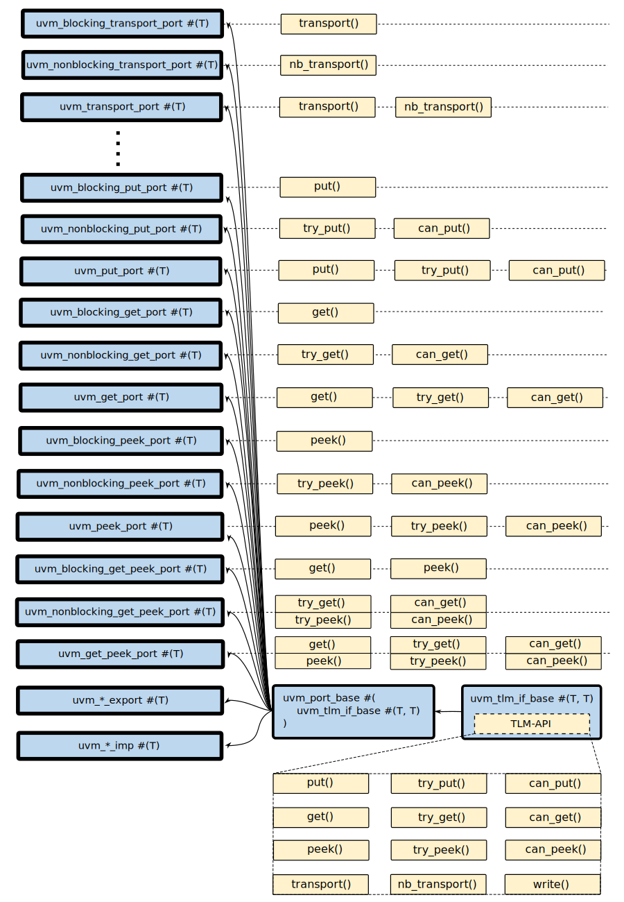
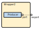

# Лабораторная работа 2 "UVM TLM"

- [Лабораторная работа 2 "UVM TLM"](#лабораторная-работа-2-uvm-tlm)
  - [Цель](#цель)
  - [Ход работы](#ход-работы)
  - [Основные обозначения](#основные-обозначения)
  - [Знания, необходимые для освоения лабораторной работы](#знания-необходимые-для-освоения-лабораторной-работы)
  - [Вступление](#вступление)
    - [SystemVerilog ООP и TBV](#systemverilog-ооp-и-tbv)
    - [TBV в UVM](#tbv-в-uvm)
  - [Теория](#теория)
    - [1. SystemVerilog параметризация классов](#1-systemverilog-параметризация-классов)
    - [2. SystemVerilog параметризация классов типами](#2-systemverilog-параметризация-классов-типами)
    - [3. UVM Transaction Level Modeling (TLM)](#3-uvm-transaction-level-modeling-tlm)
    - [4. Основные концепции UVM TLM](#4-основные-концепции-uvm-tlm)
    - [5. UVM TLM 1.0 и TLM 2.0](#5-uvm-tlm-10-и-tlm-20)
    - [6. Обзор UVM TLM 1.0](#6-обзор-uvm-tlm-10)
      - [6.1. TLM-порты](#61-tlm-порты)
      - [6.2. TLM-API](#62-tlm-api)
      - [6.3. TLM-FIFO](#63-tlm-fifo)
    - [7. Взаимосвязь TLM-портов и TLM-API](#7-взаимосвязь-tlm-портов-и-tlm-api)
      - [7.1. Реализация TLM-портов](#71-реализация-tlm-портов)
      - [7.2. Реализация TLM-API](#72-реализация-tlm-api)
      - [7.3. Имплементация API в TLM-портах](#73-имплементация-api-в-tlm-портах)
      - [7.4. Соединение TLM-портов](#74-соединение-tlm-портов)
  - [Список ссылок](#список-ссылок)

## Цель

Разбор основных концепций [Transaction-based verification (TBV)](https://github.com/MPSU/SV4DV/tree/master/lab_03%20SystemVerilog%20OOP#transaction-based-verification-tbv), реализуемых библиотеками UVM.

## Ход работы

---

## Основные обозначения

|Так выделяется важная информация, на которой стоит заострить внимание|
|:---|

_Так выделяется разбор примеров._

`Так выделяются определения, и ключевые слова SystemVerilog.`


## Знания, необходимые для освоения лабораторной работы

Для успешного усвоения материала ниже необходимо прежде усвоить 1-3 лабораторные работы курса [SV4DV от НИУ МИЭТ](https://github.com/MPSU/SV4DV/tree/master)[1].


## Вступление

### SystemVerilog ООP и TBV

В курсе [SV4DV от НИУ МИЭТ](https://github.com/MPSU/SV4DV/tree/master) уже была разобрана такая концепция, как [Transaction-based verification (TBV)](https://github.com/MPSU/SV4DV/tree/master/lab_03%20SystemVerilog%20OOP#transaction-based-verification-tbv), которая реализуется в языке описания и верификации аппаратуры SystemVerilog при помощи объектно-ориентированного программирования (`OOP`).


|В универсальной методологии верификации (`UVM`) `OOP` и `TBV` являются теми основами, на которых и основывается методология.|
|:---|

По сути своей UVM стандартизует [архитектуру верификационного ООП-окружения](https://github.com/MPSU/SV4DV/tree/master/lab_03%20SystemVerilog%20OOP#12-%D1%81%D1%82%D1%80%D1%83%D0%BA%D1%82%D1%83%D1%80%D0%BD%D0%B0%D1%8F-%D1%81%D1%85%D0%B5%D0%BC%D0%B0-%D0%B2%D0%B5%D1%80%D0%B8%D1%84%D0%B8%D0%BA%D0%B0%D1%86%D0%B8%D0%BE%D0%BD%D0%BD%D0%BE%D0%B3%D0%BE-%D0%BE%D0%BA%D1%80%D1%83%D0%B6%D0%B5%D0%BD%D0%B8%D1%8F-%D1%81-%D0%BF%D1%80%D0%B8%D0%BC%D0%B5%D0%BD%D0%B5%D0%BD%D0%B8%D0%B5%D0%BC-%D0%BE%D0%BE%D0%BF), а также методы конфигурации и взаимодействия его компонентов.


### TBV в UVM

В предыдущей лабораторной работе были разобраны основные концепции ООП, которые используются в UVM, иерархией, созданием UVM-объектов. Данная лабораторная работа посвящена разбору концепций TBV, то есть методам взаимодействия объектов верификационного окружения, которые реализованы в библиотеках UVM и уже долгое время применяются верификаторами по всему миру.


## Теория

### 1. SystemVerilog параметризация классов

|В SystemVerilog классы, так же, как и модули, можно параметризовывать.|
|:---|

_Пример._

```verilog
module class_param_0;

    class my_param_class #(parameter DEFAULT = 5);

        int my_data = DEFAULT;

        function void print();
            $display("my_data = %0d", my_data);
        endfunction

    endclass

    initial begin
        my_param_class #(5) my_class_5;
        my_param_class #(6) my_class_6;
        my_class_5 = new();
        my_class_6 = new();
        my_class_5.print();
        my_class_6.print();
    end

endmodule

```

<div style="text-align: justify">

_В данном примере класс `my_param_class` может быть параметризуется параметром `DEFAULT`. Поле объекта класса `my_data` приобретает значение `DEFAULT` сразу после создания объекта._

_Результат выполнения:_

</div>

```
# Loading sv_std.std
# Loading work.class_param_0(fast)
# run -a
# my_data = 5
```

Очень важно отметить, что параметр обладает `статической природой`. С точки зрения классов статическая природа проявлется в том, что **смена параметра меняет тип**. То есть, `my_param_class #(5)` и `my_param_class #(6)` являются **различными типами**. Сколько раз бы пользователь не создавал объект класса `my_param_class #(5)`, значение переменной `my_data` всегда будет равно `5` для любого объекта, потому что это свойства типа, а не объекта.

### 2. SystemVerilog параметризация классов типами

|Так как параметры в SystemVerilog обладают статической природой, классы SystemVerilog можно параметризовывать `типами`.|
|:---|

Вы уже сталкивались с [параметризацией типами во второй лабораторной работе курса SV4DV](https://github.com/MPSU/SV4DV/tree/master/lab_02%20SystemVerilog%20parallel%20processes#422-%D0%BF%D0%B0%D1%80%D0%B0%D0%BC%D0%B5%D1%82%D1%80%D0%B8%D0%B7%D1%83%D0%B5%D0%BC%D1%8B%D0%B9-%D0%BF%D0%BE%D1%87%D1%82%D0%BE%D0%B2%D1%8B%D0%B9-%D1%8F%D1%89%D0%B8%D0%BA) при изучении `mailbox`.

Для понимания параметризации типами подробно разберем пример.

_Пример._

```verilog
module class_param_1;

    class my_param_class #(type T = int);

        T my_data; // my_data will be type T

        function void print();
            $display("my_data is '%s' type", $typename(my_data));
        endfunction

    endclass

    initial begin
        my_param_class #(bit) my_class_bit;   // my_data is 'bit' ----
        my_param_class #(reg) my_class_logic; // my_data is 'reg'--   |
        my_class_bit   = new(); //                                 |  |
        my_class_logic = new(); //                                 |  |
        my_class_bit.print();   // my_data is 'bit' type <---------|--
        my_class_logic.print(); // my_data is 'reg' type <---------
    end

endmodule
```

<div style="text-align: justify">

_В данном примере `my_param_class` параметризуется типом `T`. При этом для типа, точно так же, как и для обычного параметра, задается значение по умолчанию (`int`). Переменная `my_data` для объекта типа `my_param_class#(T)` будет принимать иметь тип `T`._

_Например, для `T` = `bit` класс будет выглядеть следующим образом:_

</div>

```verilog
class my_param_class;

    bit my_data;

    function void print();
        $display("my_data is '%s' type", $typename(my_data));
    endfunction

endclass
```

_Функция `print()` выводит информацию о типе переменной `my_data`_.

_Результат выполнения:_

```
# Loading sv_std.std
# Loading work.class_param_1(fast)
# run -a
# my_data is 'bit' type
# my_data is 'reg' type
```

**Параметризация типами активно используется в UVM**, в том числе при реализации передачи данных между компонентами.


### 3. UVM Transaction Level Modeling (TLM)

В прошлой лабораторной работе вы познакомились с базовыми концепциями ООП, используемыми в UVM, иерархией, созданием UVM-объектов, выводом информации о них. Дело в том, что, в [верификационном ООП-окружении](https://github.com/MPSU/SV4DV/tree/master/lab_03%20SystemVerilog%20OOP#12-%D1%81%D1%82%D1%80%D1%83%D0%BA%D1%82%D1%83%D1%80%D0%BD%D0%B0%D1%8F-%D1%81%D1%85%D0%B5%D0%BC%D0%B0-%D0%B2%D0%B5%D1%80%D0%B8%D1%84%D0%B8%D0%BA%D0%B0%D1%86%D0%B8%D0%BE%D0%BD%D0%BD%D0%BE%D0%B3%D0%BE-%D0%BE%D0%BA%D1%80%D1%83%D0%B6%D0%B5%D0%BD%D0%B8%D1%8F-%D1%81-%D0%BF%D1%80%D0%B8%D0%BC%D0%B5%D0%BD%D0%B5%D0%BD%D0%B8%D0%B5%D0%BC-%D0%BE%D0%BE%D0%BF) объекты должны взаимодействовать друг с другом для передачи различной информации.

`UVM` стандартизировала механизмы взаимодействия при помощи стандарта `Transaction Level Modeling (TLM)`.


### 4. Основные концепции UVM TLM

**Стандарт `TLM` определяет взаимодействие** между UVM-объектами.

Взаимодействие **может быть**:

- однонаправленным (`unidirectional`);
- двунаправленным (`bidirectional`);
- широковещательным (`broadcasting`).

Объекты могут **выполнять роль**:

- передатчика (`producer`);
- приемника (`consumer`).

`TLM` предоставляет высокий уровень абстракции и контроля потоков данных между объектами.


### 5. UVM TLM 1.0 и TLM 2.0

`TLM` подразделяется на **`TLM 1.0` и `TLM 2.0`**. Хоть `TLM 2.0` и предоставляет более широкий набор функционала, большинство верификационных окружений (исходя из опыта автора) используют лишь функционал `TLM 1.0`. **Данная лабораторная работа ограничивается знакомством только с `TLM 1.0`**.

### 6. Обзор UVM TLM 1.0

UVM TLM 1.0 **состоит из**:

- TLM-портов:
  - `port`;
  - `export`;
  - `imp`.
- TLM-API;
- TLM-FIFO.

#### 6.1. TLM-порты

|TLM-порты подразделяются на **порты (`port`)**, **экспорты (`export`)** и **имплементации (`imp`)**. Применимость каждого типа, его обозначения на рисунках и ссылки на подробный разбор приведены в таблице ниже.|
|:---|

|Тип     | Применимость                                              | Обозначение | Подробнее |
|:-------|-----------------------------------------------------------|---|--|
| `port` | Управление потоком данных (отправка или запрос транзакций) и направление транзакций между слоями иерархии |   | [Ссылка]() |
|`export`| Направление транзакций между слоями иерархии              |   | [Ссылка]() |
|`imp`   | Реализация отправки или запроса транзакций                |   | [Ссылка]() |

Иными словами, `port` служит для инициации отправки или получения транзакции, а также для направления транзакций между слоями иерархии.
`export` служит только для направления запросов от нужного `port` к нужной `imp` внутри иерархии окружения.
`imp` реализует отправку и получение транзакции (условно говоря, `port` "просит" `imp` выполнить действие, а уже как его выполнять (то есть его реализацию) - определяет `imp`).

_Пример._


<div style="text-align: justify">

_Предположим, что объекту класса `Producer` нужно передать транзакцию объекту класса `Consumer` Транзакция должна попасть в **конкретное** место класса `Consumer`. На рисунке это место выглядит пустой коробкой с пунктирной обводкой._

_В данном примере `port` класса `Producer` инициирует передачу транзакции. Транзакция должна пройти по иерархии до момента, пока не попадет в объект типа `imp`. `export` классов `Wrapper2` и `Wrapper3` служат для передачи транзакции по иерархии. `imp` класса `Consumer` служит для того, чтобы, когда имплементация получит транзакцию, она "положила" эту транзакцию в **конкретное** место._

</div>

#### 6.2. TLM-API

| `TLM-API` (Application Programming Interface) по своей сути является набором функций (`function`) и задач (`task`) для передачи транзакций между UVM-объектами (в том числе UVM-портами). Подробный разбор методов `TLM-API` представлен [здесь](#72-tlm-api). |
|:---|

В каждом UVM-порте существует возможность вызова предопределенных TLM-API функций.

_Пример._

```verilog
class producer extends uvm_component;
    `uvm_component_utils(producer)

    // TLM port
    uvm_put_port#(int) tlm_put;

    ...
  
    task run_phase(uvm_phase phase);
        int value = 10;
        // TLM-API calls
        tlm_put.put(value);  // Blocking
        tlm_put.try_put(20); // Non-blocking
        tlm_put.can_put();   // Status
    endtask

endclass
```

<div style="text-align: justify">

_В данном примере в задаче `run_phase()` вызываются функции и задачи `TLM-API` TLM-портов._

_`put()` отправляет `value` по иерархии и не возвращается к текущей задаче (`run_phase()`) до того момента, пока получатель на том конце иерархии не получит значение, то есть не обязательно в текущий момент времени симуляции._

_`try_put()` отправляет `value` по иерархии, но только в случае, если это возможно (получатель на другом конце иерархии готов принять транзакцию). `try_put()` возвращается к текущей задаче (`run_phase()`) "сразу же", то есть в текущий момент времени симуляции._

</div>

#### 6.3. TLM-FIFO

|`TLM-FIFO` по своей сути является классом, в который инкапсулирована имплементация (`imp`) и который содержит "программную модель FIFO", которая реализуется при помощи `mailbox`. Подробный разбор `TLM-FIFO` представлен [здесь]().|
|:---|

_Пример._


<div style="text-align: justify">

_Предположим, что объекту класса `Producer` нужно передать транзакцию объекту класса `Consumer` Транзакция должна попасть в **конкретное** место класса `Consumer` На рисунке это место выглядит пустой коробкой с пунктирной обводкой._

_Пример похож на пример из [раздела 6.1.](#61-tlm-порты) Однако, в данном примере `Consumer` хочет обрабатывать по 3 транзакции за 1 момент времени. Для этого внутри класса `Consumer` объявлется `TLM-FIFO`. Как только транзакция попадает в `imp` `TLM-FIFO`, то она сохраняется во встроенный `mailbox`. После чего, данные из `mailbox` могут быть считаны при помощи методов класса `Consumer`._

</div>

### 7. Взаимосвязь TLM-портов и TLM-API

В данном разделе представлен подробный разбор TLM-портов и `TLM-API`, а также разобраны основные аспекты из взаимосвязи.

#### 7.1. Реализация TLM-портов

В `UVM` основными файлами для определения TLM-портов служат:  `uvm_ports.svh`, `uvm_exports.svh` и `uvm_imps.svh`. 

Файлы определяют соответвенно `port`, `export` и `imp`.

Рассмотрим части этих файлов.

_`uvm_ports.svh`_

```verilog

...

class uvm_blocking_put_port #(type T=int)
    extends uvm_port_base #(uvm_tlm_if_base #(T,T));
    ...
endclass 

...

class uvm_get_peek_port #(type T=int)
    extends uvm_port_base #(uvm_tlm_if_base #(T,T));
    ...
endclass 

...

```

_`uvm_exports.svh`_

```verilog

...

class uvm_blocking_put_export #(type T=int)
    extends uvm_port_base #(uvm_tlm_if_base #(T,T));
    ...
endclass

...

class uvm_get_peek_export #(type T=int)
    extends uvm_port_base #(uvm_tlm_if_base #(T,T));
    ...
endclass

...

```

_`uvm_imps.svh`_

```verilog

...

class uvm_blocking_put_imp #(type T=int)
    extends uvm_port_base #(uvm_tlm_if_base #(T,T));
    ...
endclass

...

class uvm_get_peek_imp #(type T=int)
    extends uvm_port_base #(uvm_tlm_if_base #(T,T));
    ...
endclass

...

```

Стоит отметить, что **классы TLM-портов (`uvm_*_port`, `uvm_*_export` и `uvm_*_imp`) наследуются от одного класса `uvm_port_base#(uvm_tlm_if_base #(T, T)`**, который параметризован типом `uvm_tlm_if_base #(T, T)`. Если рассмотреть файл `uvm_port_base.svh`, то можно заметить, что `uvm_port_base` наследуется от типа `IF`, которым параметризуется.

_`uvm_port_base.svh`_

```verilog
virtual class uvm_port_base #(type IF=uvm_void) extends IF;
```

То есть, **классы TLM-портов (`uvm_*_port`, `uvm_*_export` и `uvm_*_imp`) наследуются от `uvm_tlm_if_base #(T, T)`**, где `T`- тип транзакции, которая будет передаваться по портам.

Рассмотрим файл `uvm_tlm_ifs.svh`, где определен класс `uvm_tlm_if_base#(T1, T2)`.

_`uvm_tlm_ifs.svh`_

```verilog
virtual class uvm_tlm_if_base #(type T1=int, type T2=int);

  ...

  // Task: put
  //
  // Sends a user-defined transaction of type T. 
  //
  // Components implementing the put method will block the calling thread if
  // it cannot immediately accept delivery of the transaction.

  virtual task put( input T1 t );
    uvm_report_error("put", `UVM_TASK_ERROR, UVM_NONE);
  endtask

  ...

  virtual task get( output T2 t );
    uvm_report_error("get", `UVM_TASK_ERROR, UVM_NONE);
  endtask

  ...

  virtual function bit try_put( input T1 t );
    uvm_report_error("try_put", `UVM_FUNCTION_ERROR, UVM_NONE);
    return 0;
  endfunction

  ...

  virtual function void write( input T1 t );
    uvm_report_error("write", `UVM_FUNCTION_ERROR, UVM_NONE);
  endfunction

endclass
```

**Данный класс является виртуальным классом для всех классов TLM-портов и определяет [`TLM-API`](#62-tlm-api)**. Стоит отметить, что каждый класс, который наследуется от `uvm_tlm_if_base` должен самостоятельно реализовывать необходимые ему функции `TLM-API`.


#### 7.2. Реализация TLM-API

|Как было отмечено в [разделе 7.1](#71-tlm-порты), классы `uvm_*_port`, `uvm_*_export` и `uvm_*_imp` наследуются от класса `uvm_port_base#(uvm_tlm_if_base #(T, T))`, который в свою очередь наследуется от класса `uvm_tlm_if_base #(T, T)`, который предоставляет [`TLM-API`](#62-tlm-api). Методы, входящие в состав API, представлены в таблице ниже.|
|:---|

|Методы|Описание|
|:---|--|
|``` virtual task put( input T1 t );```| Блокирующая[*](#Blocking) отправка транзакции |
|``` virtual task get( output T2 t ); ```| Блокирующее[*](#Blocking) получение транзакции  |
|``` virtual task peek( output T2 t ); ```| Блокирующий[*](#Blocking) просмотр[*](#See) транзакции |
|``` virtual function bit try_put( input T1 t ); ```| Неблокирующая[*](#Non-Blocking) отправка транзакции |
|``` virtual function bit can_put(); ```| Статус возможности неблокирующе[*](#Non-Blocking) отправить транзакцию |
|``` virtual function bit try_get( output T2 t ); ```| Неблокирующее[*](#Non-Blocking) получение транзакции |
|``` virtual function bit can_get(); ```| Статус возможности неблокирующе[*](#Non-Blocking) получить транзакцию |
|``` virtual function bit try_peek( output T2 t ); ```| Неблокирующий[*](#Non-Blocking) просмотр[*](#See) транзакции |
|``` virtual function bit can_peek(); ```| Статус возможности неблокирующе[*](#Non-Blocking) просмотреть[*](#See) транзакцию |
|``` virtual task transport( input T1 req , output T2 rsp ); ```| Блокирующая[*](#Blocking) одновременная отправка и получение транзакции |
|``` virtual function bit nb_transport(input T1 req, output T2 rs );```| Неблокирующая[*](#Non-Blocking) одновременная отправка и получение транзакции |
|``` virtual function void write( input T1 t ); ```| Блокирующая[*](#Blocking) широковещательная отправка |

||
|:---|
<span id="Blocking"> ***блокирующий** - продолжающийся во времени до тех пор, пока не будет выполнен</span>
||
<span id="Non-Blocking"> ***неблокирующий** - завершающийся в текущий момент времени</span>
||
<span id="See"> ***просмотреть** - получить транзакцию, не забрав ее из TLM-порта</span>

#### 7.3. Имплементация API в TLM-портах

Теперь, когда были подробно разобраны [TLM-порты](#71-tlm-порты) и [`TLM-API`](#72-tlm-api), стоит рассмотреть принцип построения TLM-портов.

На рисунке ниже представлена часть иерархии для `uvm_*_port` представлена полностью. Также на рисунке показано, какую часть `TLM-API реализует каждый из классов`. 



_В качестве примера рассмотрим реализацию `uvm_put_port`. Данный класс в файле `uvm_ports.svh` реализуется следующим образом:_

```verilog
    ...

    class uvm_put_port #(type T=int)
        extends uvm_port_base #(uvm_tlm_if_base #(T,T));
        `UVM_PORT_COMMON(`UVM_TLM_PUT_MASK,"uvm_put_port")
        `UVM_PUT_IMP (this.m_if, T, t)
    endclass

    ...
```

_Если раскрыть defines:_

```verilog
    ...

    class uvm_put_port #(type T=int)
        extends uvm_port_base #(uvm_tlm_if_base #(T,T));
        
        function new (string name, uvm_component parent,
                int min_size=1, int max_size=1);
            super.new ("uvm_put_port", parent, UVM_PORT, min_size, max_size);
            m_if_mask = `UVM_TLM_PUT_MASK;
        endfunction

        task put (T t);
            this.m_if.put(t);
        endtask

        function bit try_put (T t);
            return this.m_if.try_put(t);
        endfunction

        function bit can_put();
          return this.m_if.can_put();
        endfunction
    
    endclass

    ...
```

<div style="text-align: justify">

_По сути `uvm_put_port` реализует часть, связанную с `put`, причем, как блокирующую, так и неблокирующую._

_Класс `uvm_blocking_put_port` будет отличаться от `uvm_put_port` тем, что реализует только блокирующую часть:_

</div>

```verilog
    ...

    class uvm_blocking_put_port #(type T=int)
        extends uvm_port_base #(uvm_tlm_if_base #(T,T));
        
        function new (string name, uvm_component parent,
                int min_size=1, int max_size=1);
            super.new ("uvm_blocking_put_port", parent, UVM_PORT, min_size, max_size);
            m_if_mask = `UVM_TLM_PUT_MASK;
        endfunction

        task put (T t);
            this.m_if.put(t);
        endtask
    
    endclass

    ...
```

Таким образом:

|UVM-порты отличаются от друга тем, какую часть `TLM-API` они реализуют.|
|:---|

#### 7.4. Соединение TLM-портов

|TLM-порты в иерархии соединяются при помощи метода `connect()`.|
|:---|

**Возможные типы соединений**:

- `port` to `port`;
- `port` to `export`;
- `port` to `imp`;
- `export` to `export`;
- `export` to `imp`.

**Запрещено** соединение `export` to `port`.

_Пример соединения._

```verilog
    class Producer extends uvm_component;
        `uvm_component_utils(Producer)

        // Internal put port
        uvm_blocking_put_port#(int) p_port;

        ...

    endclass


    class Wrapper2 extends uvm_component;
        `uvm_component_utils(Wrapper2)

        // Internal 'Producer' type component
        Producer prod;

        // Internal put export
        uvm_blocking_put_export#(int) p_export;

        ...

        virtual function void connect_phase(uvm_phase phase);
            prod.p_port.connect(p_export);
        endfunction

    endclass
```

<div style="text-align: justify">

_В данном примере в теле класса `Producer` объявляется `uvm_blocking_put_port`, а в классе `Wrapper2` объявляется `uvm_blocking_put_export`._ 

_Оба TLM-порта параметризованы типом `int`. В методе `connect_phase()` класса `Wrapper2` происходит соединение `port` класса `Producer` с `export` класса `Wrapper2` через иерерхическое обращение `prod.p_port`._

</div>



||
|:---|

## Список ссылок

| № | Описание                                                                                                             |
|---|----------------------------------------------------------------------------------------------------------------------|
|1. | [SystemVerilog для верификации цифровых устройств. Курс университета МИЭТ](https://github.com/MPSU/SV4DV/tree/master)|
|2. | Pre-Silicon Verification Using Multi-FPGA Platforms: A Review, Umer Farooq &  Habib Mehrez                           |