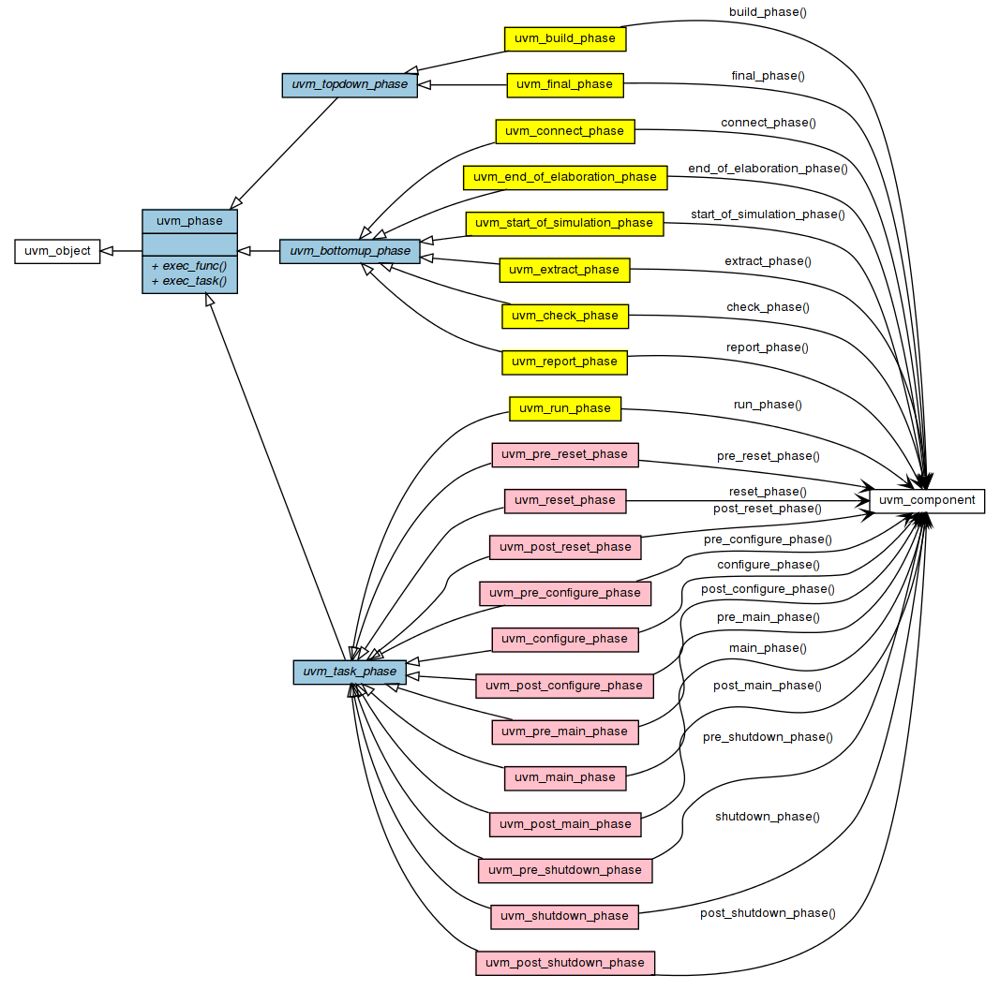

# Лабораторная работа 3 "Фазы в UVM. База ресурсов в UVM"

- [Лабораторная работа 3 "Фазы в UVM. База ресурсов в UVM"](#лабораторная-работа-3-фазы-в-uvm-база-ресурсов-в-uvm)
  - [Фазы в UVM](#фазы-в-uvm)
    - [Этапы моделирования](#этапы-моделирования)
      - [Этап построения](#этап-построения)
      - [Этап выполнения](#этап-выполнения)
      - [Этап завершения](#этап-завершения)
    - [Описание фаз](#описание-фаз)
    - [UVM-фазы в иерархии классов](#uvm-фазы-в-иерархии-классов)
    - [Синхронизация фаз](#синхронизация-фаз)
      - [Возражения (objections)](#возражения-objections)
    - [Phase jumping](#phase-jumping)
  - [База ресурсов в UVM](#база-ресурсов-в-uvm)
    - [Основные операции с базой ресурсов:](#основные-операции-с-базой-ресурсов)
      - [Добавление ресурса в базу](#добавление-ресурса-в-базу)
      - [Доступ к ресурсу по его имени](#доступ-к-ресурсу-по-его-имени)
      - [Доступ к ресурсу по его типу](#доступ-к-ресурсу-по-его-типу)
  - [Практика](#практика)
  - [Использованные ресурсы](#использованные-ресурсы)

## Фазы в UVM

Одной из ключевых концепций UVM являются **фазы** (**uvm_phases**), делящие процесс моделирования на отдельные этапы и шаги. Фазы обеспечивают структурированное выполнение и синхронизацию между множеством различных компонентов верификационного окружения.

В библиотеке UVM существует 21 фаза, разбитые по трем категориям (этапам процесса моделирования), кроме того, разработчик может создавать и собственные фазы. Несмотря на все это многообразие, разработчик не обязан использовать все эти фазы (в минимальном варианте ему потребуется только три).

### Этапы моделирования

Рассмотрим три этапа моделирования, на которые разбиты фазы UVM:

- этап построения;
- этап моделирования;
- этап завершения.

#### Этап построения

Данный этап отвечает за построение иерархии верификационного окружения и межсоединения его компонентов. Этап состоит из 4-х фаз, но ключевыми в нем можно выделить следующие две:

- `build_phase`
- `connect_phase`

Как нетрудно догадаться по первому предложению этого параграфа, `build_phase` отвечает за шаг построения иерархии верификационного окружения. На этом этапе строится компонент **верхнего** уровня (`uvm_test`), в процессе построения которого создаются его дочерние компоненты (**нижележащие** компоненты в иерархии верификационного окружения). Запомним эту особенность: "выполнение фазы идет сверху-вниз", она пригодится нам позднее.

В свою очередь, `connect_phase` отвечает за межсоединение компонентов посредством **портов** (о которых вы узнали в [лабораторной №2](../lab02_tlm_and_sync/)). При этом компоненты соединяются **снизу-вверх**: начиная от компонентов нижних уровней и идя в сторону вышележащих компонентов.

Важно отметить, что все фазы этапа построения исполняются в нулевой момент моделирования и не потребляют его времени (т.е. данные фазы реализованы в виде **функций**).

#### Этап выполнения

Данный этап выполняет непосредственно моделирование (симуляцию/эмуляцию) верифицируемого устройства, во время которого верификационное окружение подает на входы верифицируемого устройства тестовые воздействия и снимает результаты с его выходов.

Этап выполнения состоит из фазы `run_phase`, которая в свою очередь может быть разделена на 12 фаз (4 группы по три фазы в каждой). После мы детально пройдемся по каждой из фаз, пока что же важно отметить, что для этапа выполнения при минимальном запуске достаточно воспользоваться одной лишь `run_phase`. Эта фаза, а так же `build_phase` и `connect_phase` и составляют те три фазы, использования которых достаточно для запуска простейшего окружения.

Только фазы этапа выполнения могут потреблять время моделирования (а значит, эти фазы могут быть только **задачами** (**tasks**)).

#### Этап завершения

Этап завершения отвечает за подведение итогов текущего моделирования: получение результатов из **таблицы результатов** (**scoreboard**), формирование отчетов об ошибках и покрытии.

### Описание фаз

Ниже вы можете прочитать описание каждой из фаз. Описание подфаз `run_phase` вынесены в отдельную таблицу.

| Фаза                  | Описание                                                                                                                                                  | Порядок выполнения |
|-----------------------|-----------------------------------------------------------------------------------------------------------------------------------------------------------|--------------------|
| `build`               | Используется для построения компонентов верификационного окружения                                                                                        | сверху-вниз        |
| `connect`             | Используется для соединения TLM-портов компонентов                                                                                                        | снизу-вверх        |
| `end_of_elaboration`  | Используется для внесения последних корректировок в структуру, конфигурацию или соединения верификационного окружения перед началом симуляции             | снизу-вверх        |
| `start_of_simulation` | Используется для вывода информации о топологии или конфигурации верификационного окружения                                                                | снизу-вверх        |
| `run`                 | Используется для генерации и выставления тестовых воздействий, снятия результатов и проверки                                                              | параллельно        |
| `extract`             | Используется для извлечения и обработки информации из панелей оценки и мониторов функционального покрытия                                                 | снизу-вверх        |
| `check`               | Используется для проверки того, что DUT вел себя корректно, и для выявления возможных ошибок, которые могли возникнуть во время выполнения моделирования  | снизу-вверх        |
| `report`              | Используется для отображения результатов симуляции или записи результатов в файл                                                                          | снизу-вверх        |
| `final`               | Используется для завершения всех остальных действий, которые верификационное окружение еще не завершило                                                   | сверху-вниз        |

_Таблица 1. Описание основных фаз_

| Фаза              | Описание                                                                                                                                                                                                |
| ----------------- | ------------------------------------------------------------------------------------------------------------------------------------------------------------------------------------------------------- |
| `pre_reset`       | Фаза pre_reset начинается одновременно с фазой run. Ее целью является обеспечение всех необходимых действий, которые должны произойти перед сбросом, такие как ожидание активации сигнала "power-good". |
| `reset`           | Фаза reset предназначена для выполнения шагов по сбросу интерфейсов и DUT. Например, в этой фазе генерируется сброс, а сигналы интерфейсов переводятся в состояния по умолчанию.                        |
| `post_reset`      | Предназначена для любой активности, необходимой сразу после сброса.                                                                                                                                     |
| `pre_configure`   | Фаза pre_configure предназначена для подготовки к процессу конфигурации DUT после завершения сброса.                                                                                                    |
| `configure`       | Фаза configure используется для инициализации DUT и любой памяти тестовой среды для подготовки к началу тестового сценария.                                                                             |
| `post_configure`  | Фаза post_configure используется для ожидания завершения эффектов конфигурации в DUT или достижения состояния, в котором он готов к началу основного тестового стимула.                                 |
| `pre_main`        | Фаза pre_main используется для проверки того, что все необходимые компоненты готовы начать генерацию воздействий.                                                                                       |
| `main`            | Именно во время этой фазы генерируются тестовые воздействия текущего сценария, которые подаются на DUT. Данная фаза заканчивается по исчерпанию всех запланированных воздействий или по тайм-ауту.      |
| `post_main`       | Фаза post_main используется для завершения основной фазы.                                                                                                                                               |
| `pre_shutdown`    | Эта фаза служит буфером для любых воздействий на DUT, которые должны произойти перед фазой shutdown.                                                                                                    |
| `shutdown`        | Фаза shutdown используется для проверки того, что результаты воздействий, сгенерированных во время основной фазы, прошли через DUT и были получены все выходные данные.                                 |
| `post_shutdown`   | Выполняются завершающие действия перед выходом из этапа запуска. По завершении фазы post_shutdown, происходит этап завершения.                                                                          |

_Таблица 2. Описание подфаз `run_phase`_

### UVM-фазы в иерархии классов

Теперь, когда у вас есть базовое представление о UVM-фазах, рассмотрим их структуру с точки зрения классов UVM.



_Рисунок 1. UVM-фазы в иерархии классов_

Все фазы этапа выполнения наследуются от класса `uvm_task_phase` (т.к. все эти фазы способны потреблять время моделирования). Остальные фазы разделены по предкам `uvm_topdown_phase` и `uvm_bottomup_phase`. Помните про особенности выполнение "сверху-вниз/снизу-вверх", о которых говорилось в "[Этапе построения](#этап-построения)"? Внимательный читатель мог так же обратить внимание на столбец "Порядок выполнения" в таблице 1. Данный столбец и указывает на то, какая фаза наследуется от какого предка.

В свою очередь данные родительские классы наследуются от класса `uvm_phase`, содержащего виртуальную функцию `exec_func` и виртуальную задачу `exec_task`. При этом все дочерние фазы вызывают вызывают соответствующую им функцию или метод объектов `uvm_component`.

### Синхронизация фаз

Как было сказано ранее, фазы используются для синхронизации работы различных компонентов. Иными словами, компоненты работают независимо друг от друга, и каждый из них может завершить свою фазу раньше или позже других. Смысл фаз заключается в том, что компонент, завершивший фазу раньше других, ждет пока остальные также не завершат эту фазу.

Пример: у нас есть два активных агента. Одному нужно для сброса `100ns`, другому `500ns`. Если бы не было синхронизации, первый агент завершил бы процесс сброса и сразу же приступил бы к подаче тестовых воздействий, не смотря на то, что одна из верифицируемых частей еще не готова и все ещё находится в состоянии сброса.

Как понять, когда компонент готов завершить фазу? Ведь в коде фазы может по объективным причинам находиться бесконечный цикл и тогда этот код не закончится никогда.

Для этого в классе `uvm_phase` находится объект класса `uvm_objection`.

#### Возражения (objections)

Помните, как в американских фильмах в сценах где происходит заседание суда адвокаты громко кричат "**Протестую!**"? Так вот, по английски они в это время кричат "**Objection!**". Когда компоненты переходят в фазы этапа запуска, окружение проверяет, **возражает** ли какой-либо компонент против того, чтобы перейти к следующей фазе. Если **возражений** нет — фаза немедленно завершается (даже если какой-то компонент не выполнил весь код этой фазы, или не завершил бесконечный цикл).

Сам процесс **возражения** выражается в вызове метода `raise_objection`. А снятие **возражения** выражается в вызове метода `drop_objection`. Когда все возражения сняты, происходит переход к следующей фазе.

### Phase jumping

Will be done later.

<!-- 
Рассказать про прыжки, юзкейс: тест ресета.
http://www.sunburst-design.com/papers/HunterSNUGSV_UVM_Resets_paper.pdf
https://semiconreferrals.com/advanced-usage-of-uvm-phasing/
Разобраться с phase.jump vs domain.jump
 -->

---

## База ресурсов в UVM

> **Примечание**. В большинстве руководств по UVM обмен ресурсами между компонентами осуществляется с помощью `uvm_config_db`. В 2023 году вышла статья "The Untapped Power of UVM Resources and Why Engineers Should Use the uvm_resource_db API", объясняющая почему данное поведение не является рекомендуемым. В данной лабораторной работе будет рассказано как осуществлять обмен ресурсами посредством `uvm_resource_db`.
> Важно отметить, что ни `uvm_config_db` ни `uvm_resource_db` не являются базами данных. Вместо этого и то и то является лишь API по доступу к одной и той же базе данных.

`uvm_resource_db` предоставляет верификационному окружению механизм для управления и доступа к конфигурационным и динамическим ресурсам. Данный механизм позволяет хранить и извлекать ресурсы в структуре, аналогичной иерархической базе данных. Эта база данных обычно используется для настройки компонентов и тестовых последовательностей, что делает ее ключевым элементом для создания гибкого и многократно используемого верификационного окружения.

В простейшем случае, база ресурсов может быть использована для передачи указателя на виртуальный интерфейс. В более сложных сценариях, в базе ресурсов хранятся конфигурационные параметры, влияющие на структуру верификационного окружения и тестовые сценарии. К примеру, этот параметр может определить будет ли создан дочерний компонент, или нет.

### Основные операции с базой ресурсов:

С полным списком можно ознакомиться [здесь](https://verificationacademy.com/verification-methodology-reference/uvm/docs_1.1c/html/files/base/uvm_resource_db-svh.html).

#### Добавление ресурса в базу

Добавление ресурса в базу осуществляется вызовом статического метода `set`, обладающего следующим прототипом:

```SystemVerilog
static function void set( input string scope,
                          input string name,
                                     T val,
                          input uvm_object accessor = null);
```

Пример использования:

```SystemVerilog
uvm_resource_db#(virtual dut_if)::set("_agnt_", "vif", dif);
uvm_resource_db#(int)::set ("*.e*", "has_cov", 1, this);
uvm_resource_db#(string)::set("*agnt1", "msg1", "Warn1", this);
uvm_resource_db#(env_cfg)::set ("*.e*", "env_cfg", cfg, this);
```

#### Доступ к ресурсу по его имени

```SystemVerilog
static function bit read_by_name( input   string      scope,
                                  input   string      name,
                                  inout   T           val,
                                  input   uvm_object  accessor = null);
```

Пример использования:

```SystemVerilog
uvm_resource_db#(agnt_config)::read_by_name(get_full_name(), "cfg", cfg, this);
```

#### Доступ к ресурсу по его типу

```SystemVerilog
static function bit read_by_type( input   string      scope,
                                  inout   T           val,
                                  input   uvm_object  accessor = null);
```

Пример использования:

```SystemVerilog
uvm_resource_db#(virtual dut_if)::read_by_type(get_full_name(), vif, this);
```

## Практика


## Использованные ресурсы

1. [UVM Tutorial for Candy Lovers – 22. Phasing](http://cluelogic.com/2014/08/uvm-tutorial-for-candy-lovers-phasing/)
2. [UVM Phases top down](https://verificationguide.com/uvm/uvm-phases)
3. [The Untapped Power of UVM Resources and Why Engineers Should Use the uvm_resource_db API](http://www.sunburst-design.com/papers/CummingsDVCon2023_uvm_resource_db_API.pdf)
