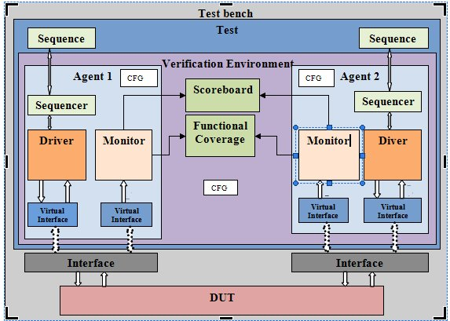
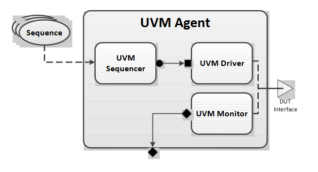
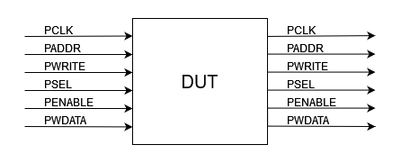
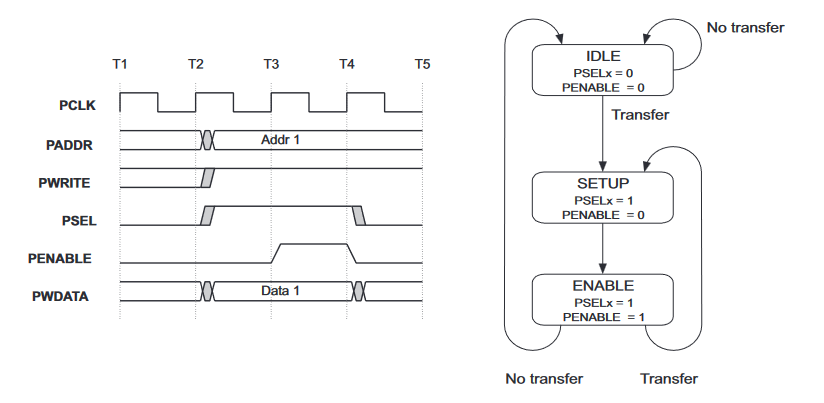
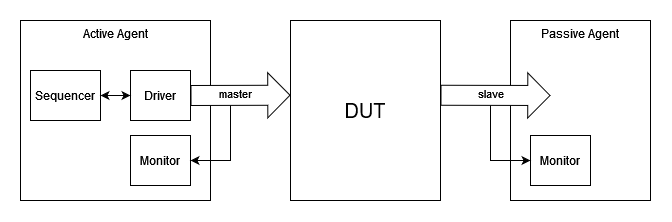

# Лабораторная работа 4 "Реализация агента в UVM: sequencer, driver, monitor, agent"

- [Лабораторная работа 4 "Реализация агента в UVM: sequencer, driver, monitor, agent"](#лабораторная-работа-4-реализация-агента-в-uvm-sequencer-driver-monitor-agent)
  - [Назначение агента в структуре верификационного окружения](#назначение-агента-в-структуре-верификационного-окружения)
    - [Монитор](#монитор)
    - [Драйвер](#драйвер)
    - [Контроллер последовательностей (секвенсер)](#контроллер-последовательностей-секвенсер)
  - [Практика](#практика)
    - [Реализация монитора](#реализация-монитора)
    - [Реализация пассивного агента](#реализация-пассивного-агента)
    - [Реализация секвенсера](#реализация-секвенсера)
    - [Реализация драйвера](#реализация-драйвера)
    - [Реализация конфигурируемого агента](#реализация-конфигурируемого-агента)
  - [Задание](#задание)
  - [Использованные ресурсы](#использованные-ресурсы)

## Назначение агента в структуре верификационного окружения

Рассмотрим возможную структуру иерархии верификационного окружения по UVM, представленную на рис. 1:



_Рисунок 1. Пример структуры верификационного окружения UVM_[[1]](https://iaeme.com/Home/article_id/IJECET_07_03_004)

**Агент** — это компонент, который группирует все верификационные подкомпоненты, взаимодействующие с конкретным интерфейсом верифицируемого устройства[[2]](https://accellera.org/images/downloads/standards/uvm/uvm_users_guide_1.2.pdf#G3.1052715).

С точки зрения верифицируемого устройства, агент — это устройство, которое подключено по ту сторону интерфейса.

При это сам по себе агент не обязан представлять собой какую-то специфичную реализацию конкретного устройства. Он может просто осуществлять обмен данными по стандартному интерфейсу, в соответствии с его спецификацией, в то время как особенности конкретного устройства будут выражены в **последовательностях** (**sequences**) и **таблицах результатов**(**scoreboards**).

Рассмотрим структуру агента, представленную на рис. 2:



_Рисунок 2. Структура Агента[[2]](https://accellera.org/images/downloads/standards/uvm/uvm_users_guide_1.2.pdf#G3.1052715)_

Агент состоит из трех компонентов: монитора, драйвера и контроллера последовательностей.

### Монитор

Монитор представляет собой компонент, реализующий анализатор траффика определенного интерфейса. Он отслеживает транзакции, которые были переданы через интерфейс чтобы затем, передать их верификационному окружению (в таблицу результата и контроллер функционального покрытия).

Монитор никак не влияет на работу интерфейса и является **пассивным** наблюдателем.

### Драйвер

Драйвер, в противоположность монитору, **активно** взаимодействует с интерфейсом и осуществляет полный контроль над входными сигналами верифицируемого устройства (кроме может быть сигналов тактирования и сброса). Драйвер является компонентном, реализующим протокол осуществления транзакций на выбранном интерфейсе. Драйвер не определяет что будет передано по данному интерфейсу (содержимое транзакций), он только определяет то как именно должны себя вести входные сигналы верифицируемого устройства, чтобы данная транзакция была передана.

Какие именно транзакции будут переданы посредством драйвера решает последний из перечисленных компонентов: контроллер последовательностей.

### Контроллер последовательностей (секвенсер)

Контроллер последовательностей осуществляет...контроль последовательностей транзакций, которые должны быть переданы драйвером верифицируемому устройству. Секвенсер не осуществляет генерацию последовательностей и не управляет тем какая транзакция будет сгенерирована, вместо этого он осуществляет контроль над ходом исполнения последовательностей.

Предположим, мы хотим верифицировать модуль-контроллер сетевой карты. Данные по ethernet могут приходит отдельными частями, разбитыми на фреймы, причем фреймы от различных источников приходят вперемешку.

Теоретически, можно было бы создать последовательность, в которой смешаны фреймы разных источников, но куда проще создать непрерывные последовательности транзакций от каждого источника, и смешивать их вместе. Именно эту роль и может выполнять секвенсер.

---

Обобщим итоговую информацию. Агент представляет собой компонент, осуществляющий общение между верификационным окружением и верифицируемым устройством по одному из интерфейсов. Управление сигналами интерфейса осуществляется посредством драйвера. Считывание всех транзакций, которые были переданы на данном интерфейсе (в любую сторону) и передача их верификационному окружению осуществляется монитором. Секвенсер отвечает за контролем хода передачи последовательности транзакций.

Обратите внимание на выделенные ранее слова: "**пассивным**" и "**активно**".

В случае, если интерфейс верифицируемого устройства не предполагает использования входных сигналов (иными словами, если верифицируемое устройство имеет только выходные сигналы на данном интерфейсе), агент не может управлять сигналами этого интерфейса и не должен иметь драйвер. Подобный агент называется **пассивным** и содержит только монитор.

Агент, содержащий **активный** компонент (драйвер) называется активным.

Для того, чтобы различать активные и пассивные агенты, в классе `uvm_agent` существует поле `is_active`, которое может принять одно из двух значений перечисления `uvm_active_passive_enum`:

- `UVM_ACTIVE`
- `UVM_PASSIVE`

Для получения информации из этого поля существует метод-геттер: `get_is_active`, возвращающий `True`, если `is_active == UVM_ACTIVE`

При описании агента можно озаботиться тем, чтобы тот мог быть как активным, так и пассивным. Выбор конкретного типа агента осуществится в момент построения иерархии, когда агент получит конфигурационный файл из базы данных ресурсов, где будет указан его тип. В этом случае, агент описывается так, как если бы он был активным, однако создание его активных частей в фазе построения, и их подключение в фазе подключения должно происходить только если агент является активным.

## Практика

Рассмотрим создание агентов, взаимодействующих с верифицируемым устройством по двум интерфейсам [AMBA 2 APB](https://documentation-service.arm.com/static/5f916403f86e16515cdc3d71), один из которых является ведущим интерфейсом относительно верифицируемого устройства, а другой — ведомым:



_Рисунок 3. Подключение к верифицируемому устройству_

Осуществление записи по протоколу AMBA 2 APB осуществляется следующим образом:



_Рисунок 4. Запись транзакции по протоколу AMBA 2 APB[[4]](https://documentation-service.arm.com/static/5f916403f86e16515cdc3d71)_

На очередном такте `PCLK`, когда ведущее устройство собирается инициировать передачу данных, оно выставляет адрес на шине `PADDR`, значение `1` на сигналах `PWRITE`и `PSEL` и данные для записи на шине `PWDATA`.

На следующем такте ведущее устройство выставляет значение `1` на сигнале `PENABLE`, удерживая выставленные значения на остальных сигналах. На этом передача транзакции завершается.

В случае, если ведущее устройство собирается передать что-то еще, оно выставляет значение сигналов `PADDR`, `PWRITE` и `PWDATA`, удерживая сигнал `PSEL` и выставив `0` на сигнал `PENABLE`.

В противном случае, ведущее устройство выставляет значение `0` как на сигнал `PENABLE`, так и на `PSEL`.

Для простоты примера, данные интерфейсы поддерживают исключительно операции записи.

На рис. 5 показано, как агенты будут подключены к данному устройству:



_Рисунок 5. Подключение агентов к верифицируемому устройству_

Реализацию данной схемы лучше всего выполнить в следующем порядке:

1. Реализовать компонент "монитор";
2. Реализовать компонент "пассивный агент";
3. Реализовать компонент "секвенсер";
4. Реализовать компонент "драйвер";
5. Реализовать компонент "агент", содержащий подкомпоненты "монитор", "секвенсер" и "драйвер", и который, в зависимости от конфигурации, может быть как активным, так и пассивным.

### Реализация монитора

Для реализации монитора нам нужно две вещи: доступ к интерфейсу, транзакции на котором мы будем считывать и tlm-порт, в который мы будем передавать считанные данные:

```SystemVerilog
class apb_monitor extends uvm_monitor;
  `uvm_component_utils(apb_monitor)

  uvm_analysis_port#(apb_transaction) port;

  virtual apb_interface vif;

  function new(string name, uvm_component parent);
    super.new(name, parent);
  endfunction: new

  function void build_phase(uvm_phase phase);
    super.build_phase(phase);
    port = new("port", this);
    assert(uvm_resource_db#(virtual dut_if)::read_by_type(get_full_name(), vif, this))
    else $fatal(-1, "Can't access dut_if by %s", get_full_name());
  endfunction: build_phase

endclass: apb_monitor
```

Создание tlm-порта осуществляется достаточно просто: достаточно объявить объект класса `uvm_analysis_port` параметризованного классом `apb_transaction`, и затем создать его во время `build_phase`. В последствии его надо будет подключить, но это произойдет во время описания агента.

Рассмотрим то как был проинициализирован объект виртуального интерфейса:

```SystemVerilog
assert(uvm_resource_db#(virtual dut_if)::read_by_type(get_full_name(), vif, this))
else $fatal(-1, "Can't access dut_if by %s", get_full_name());
```

Начнем с блока `assert/else`. В данном контексте, конструкция `assert/else` схожа с `if/else`, разница в смыслах, вкладываемых в эти конструкции. `if/else` допускает как выполнение, так и не выполнение проверяемого условия и описывает что нужно делать в том или ином случае. `assert` не допускает невыполнения условия, это утверждение о том, что условие точно должно выполниться. Блок `else` используется для описания действий, которые необходимо выполнить, если это утверждение будет нарушено.

Статическая функция `read_by_type` класса `uvm_resource_db` возвращает `1` в случае успешного получения к запрашиваемому ресурсу и `0` в случае неудачи. При этом, мы гарантируем что вызов этой функции должен выполниться успешно (иначе мы банально не сможем продолжить работу, если не проинициализируем объект виртуального интерфейса). Именно поэтому здесь используется `assert/else` вместо `if/else`.

Почему для доступа к `uvm_resource_db` был выбран метод `read_by_type`, а не `read_by_name`? Дело в том, что мы описываем компонент, который будет использоваться как для активного, так и для пассивного агента. Эти агенты будут использовать ресурсы с одним и тем же типом, но разными именами. Поэтому, вместо того чтобы реализовывать дополнительную логику по передаче в монитор имени конкретного интерфейса, используемого данным агентом, монитор будет пытаться получить любой доступный ресурс с заданным типом. После нам только останется правильным образом разграничить доступ к этим интерфейсам.

Теперь, когда в мониторе есть все необходимое для его работы, осталось реализовать его логику.

```SystemVerilog
class apb_monitor extends uvm_monitor;
  `uvm_component_utils(apb_monitor)

  uvm_analysis_port#(apb_transaction) port;

  virtual apb_interface vif;

  function new(string name, uvm_component parent);
    super.new(name, parent);
  endfunction: new

  function void build_phase(uvm_phase phase);
    port = new("port", this);
    assert(uvm_resource_db#(virtual dut_if)::read_by_type(get_full_name(), vif, this))
    else $fatal(-1, "Can't access dut_if by %s", get_full_name());
  endfunction: build_phase

  task run_phase(uvm_phase phase);
    forever begin
      @vif.monitor_cb;
      if(vif.monitor_cb.sel) begin
        @vif.monitor_cb;
        assert(vif.monitor_cb.enable)
        else begin
          $error("Protocol violation: ENABLE state should have enable == 1");
          continue;
        end
        apb_transaction mon_trans;
        mon_trans = apb_transaction::type_id::create("mon_trans",this);
        mon_trans.addr  = vif.monitor_cb.addr;
        mon_trans.write = vif.monitor_cb.write;
        mon_trans.wdata = vif.monitor_cb.wdata;
        port.write(mon_trans);
      end
   endtask: run_phase

endclass: apb_monitor
```

Монитор в бесконечном цикле каждый такт проверяет значение сигнала `PSEL`. Если тот в какой-то момент стал равен единице, то на следующий такт сигнал `PENABLE` тоже обязан стать равным единице. Если это произошло, осуществилась запись транзакции и монитор сохраняет значение всех информационных сигналов в объект транзакции, после чего записывает его в tlm-порт. В случае, если на следующий такт после поднятия сигнала `PSEL`, сигнал `PENABLE` так и остался равен нулю — значит произошло нарушение протокола. В этом случае, монитор пропускает этап генерации и записи транзакции и переходит к ожиданию следующей инициации передачи.

### Реализация пассивного агента

Пока агент содержит всего один компонент: монитор. Поэтому его создание достаточно тривиальное:

```SystemVerilog
class apb_agent extends uvm_agent;
  `uvm_component_utils(apb_agent)

  uvm_analysis_port#(apb_transaction) an_port;

  apb_monitor   monitor;

  function new(string name, uvm_component parent);
    super.new(name, parent);
  endfunction: new

  function void build_phase(uvm_phase phase);
    an_port = new("an_port", this);
    monitor = apb_monitor::type_id::create("apb_monitor", this);
  endfunction: build_phase

  function void connect_phase(uvm_phase phase);
    monitor.port.connect(an_port);
  endfunction: connect_phase

endclass: apb_agent
```

Мы объявили два объекта: монитор и tlm-порт, которые были созданы в фазе `build_phase` и подключены в фазе `connect_phase`.

Агент не должен ничего выполнять во время выполнения моделирования, поэтому он не содержит фазы `run_phase`.

### Реализация секвенсера

Перейдем к созданию компонентов активного агента. Начнем с контроллера последовательностей (секвенсера).

В случае, если секвенсер выполняет только одну последовательность он может быть реализован в виде готового класса библиотеки uvm:

```SystemVerilog
typedef uvm_sequencer#(apb_transaction) apb_sequencer;
```

Здесь мы объявляем новый тип (класс) `apb_sequencer`, представляющий собой класс `uvm_sequencer`, который был параметризован классом `apb_transaction`.

### Реализация драйвера

Реализация драйвера будет достаточно похожа на реализацию монитора. Только если монитор считывает данные с интерфейса и в результате создает объект транзакции, то драйвер наоборот — принимает транзакцию и выполняет установку сигналов на интерфейсе.

Помимо прочего, когда драйвер наследуется от класса `uvm_driver`, тот должен быть параметризован типом транзакций. Благодаря этому, драйвер будет с самого начала иметь tlm-порт `seq_item_port`, через который в драйвер будут поступать транзакции:

```SystemVerilog
class apb_master extends uvm_driver#(apb_transaction);
  `uvm_component_utils(apb_master)

  virtual apb_interface vif;

  function new(string name, uvm_component parent);
    super.new(name, parent);
  endfunction: new

  function void build_phase(uvm_phase phase);
    assert(uvm_resource_db#(virtual dut_if)::read_by_type(get_full_name(), vif, this))
    else $fatal(-1, "Can't access dut_if by %s", get_full_name());
  endfunction: build_phase

  task run_phase(uvm_phase phase);
    apb_transaction drv_trans;
    seq_item_port.get_next_item(drv_trans);
    @vif.master_cb;
    forever begin
      vif.master_cb.sel     <= 1'b1;
      vif.master_cb.enable  <= 1'b0;
      vif.master_cb.write   <= 1'b1;
      vif.master_cb.addr    <= drv_trans.addr;
      vif.master_cb.wdata   <= drv_trans.wdata;
      @vif.master_cb;
      vif.master_cb.enable  <= 1'b1;
      @vif.master_cb;
      seq_item_port.item_done();
      vif.master_cb.sel     <= 1'b0;
      vif.master_cb.enable  <= 1'b0;
      seq_item_port.get_next_item(drv_trans);
      repeat(urandom_range(4)) begin
        @vif.master_cb;
      end
   endtask: run_phase

endclass: apb_master
```

Драйвер получает очередную транзакцию через блокирующий вызов `get_next_item`. Затем, на протяжении двух тактов `PCLK`, драйвер осуществляет выставление сигналов в соответствии с протоколом. После чего на очередном такте драйвер завершает исполнение транзакции. Обнуляет управляющие сигналы и выжидает случайное (от нуля до четырех) количество тактов, прежде чем запросит очередную транзакцию.

### Реализация конфигурируемого агента

Реализация конфигурируемого агента будет во многом похожа на создание пассивного агента — только появится два дополнительных компонента, которые нужно создать в `build_phase` и соединить в `connect_phase` в случае, если конфигурационный файл говорит, что данный агент является активным.

```SystemVerilog
class apb_agent extends uvm_agent;
  `uvm_component_utils(apb_agent)

  uvm_analysis_port#(apb_transaction) an_port;

  apb_sequencer sequencer;
  apb_master    driver;
  apb_monitor   monitor;

  apb_agent_cfg cfg;

  function new(string name, uvm_component parent);
    super.new(name, parent);
  endfunction: new

  function void build_phase(uvm_phase phase);
    assert(uvm_resource_db#(apb_agent_cfg)::read_by_type(get_full_name(), cfg, this))
    else $fatal(-1, "Can't access agent_cfg by %s", get_full_name());
    is_active = cfg.active;

    an_port = new("an_port", this);
    monitor = apb_monitor::type_id::create("apb_monitor", this);

    if(get_is_active)begin
      sequencer = apb_sequencer::type_id::create("apb_sequencer", this);
      driver    = apb_master::type_id::create("apb_master", this);
    end
  endfunction: build_phase

  function void connect_phase(uvm_phase phase);
    monitor.port.connect(an_port);
    if(get_is_active)begin
      driver.seq_item_port.connect(sequencer.seq_item_export);
    end
  endfunction: connect_phase

endclass: apb_agent
```

## Задание

Реализовать агент ведущего устройства интерфейса [`AXI4 Stream`](https://documentation-service.arm.com/static/64819f1516f0f201aa6b963c).

Для простоты реализации, агент данного интерфейса не будет использовать сигналы:

- `TSTRB`
- `TKEEP`
- `TDEST`
- `TUSER`
- `TWAKEUP`

Ширина сигнала `TDATA` составляет 32 бита.

Важно отметить данном интерфейсе присутствует входной сигнал `TREADY`, а так же то, что спецификация накладывает жесткие требования на изменение всех выходных сигналов после установки сигнала `TVALID`.

Кроме того, данный интерфейс содержит сигнал сброса, а значит фазу `run_phase` будет необходимо разделить на фазы `reset_phase` и `main_phase`.

## Использованные ресурсы

1. [Pankaj S.Vitankar and Dr. A. K. Kureshi, UVM Architecture for verification, International Journal of Electronics and Communication Engineering & Technology, 7(3), 2016, pp. 29–37.](https://iaeme.com/Home/article_id/IJECET_07_03_004)
2. [Universal Verification Methodology (UVM) 1.2 User’s Guide, pp. 2-3](https://accellera.org/images/downloads/standards/uvm/uvm_users_guide_1.2.pdf#G3.1052715)
3. [The Untapped Power of UVM Resources and Why Engineers Should Use the uvm_resource_db API](http://www.sunburst-design.com/papers/CummingsDVCon2023_uvm_resource_db_API.pdf)
4. [AMBA™ Specification (Rev 2.0)](https://documentation-service.arm.com/static/5f916403f86e16515cdc3d71)
