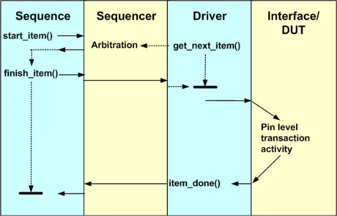
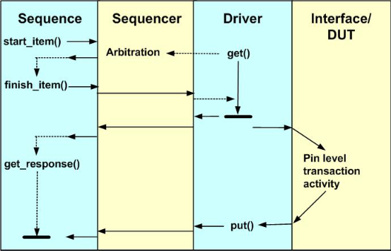
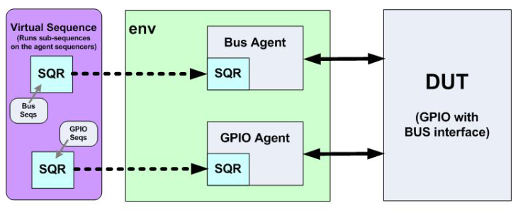

# Лабораторная работа 5 "Генерация последовательности транзакций и их маршрутизация к драйверу"

- [Лабораторная работа 5 "Генерация последовательности транзакций и их маршрутизация к драйверу"](#лабораторная-работа-5-генерация-последовательности-транзакций-и-их-маршрутизация-к-драйверу)
  - [Последовательность транзакций](#последовательность-транзакций)
  - [Взаимодействие драйвера и секвенсера](#взаимодействие-драйвера-и-секвенсера)
  - [Взаимодействие последовательности и контроллера последовательностей](#взаимодействие-последовательности-и-контроллера-последовательностей)
  - [Рукопожатие драйвера и секвенсера](#рукопожатие-драйвера-и-секвенсера)
    - [Используя вызовы get\_next\_item/item\_done](#используя-вызовы-get_next_itemitem_done)
    - [Используя вызовы get/put](#используя-вызовы-getput)
  - [Арбитраж запросов](#арбитраж-запросов)
  - [Виртуальная последовательность](#виртуальная-последовательность)
  - [Задание](#задание)
  - [Список литературы](#список-литературы)


В упрощенном виде, верификация устройства заключается в генерации последовательностей тестовых воздействий, подаче их на верифицируемое устройство а так же получении и оценке результатов. В предыдущей лабораторной работе был описаны компоненты, которые отвечают за подачу тестовых воздействий и снятие результатов (драйвер и монитор). Сейчас же мы разберем как транзакции попадают в драйвер.

Процесс передачи транзакции задействует три независимых сущности: последовательность, контроллер последовательности (секвенсер) и драйвер. Все эти сущности запущены параллельно, поэтому неудивительно что их работа нуждается в синхронизации. Эту синхронизацию обеспечивает механизм, известный как **Рукопожатие драйвера и секвенсера** (**driver sequencer handshake**).

Но прежде чем рассмотреть данный механизм, необходимо разобраться в том, что такое последовательность, а так же то, как эти сущности общаются друг с другом.

## Последовательность транзакций

Как говорилось в предыдущей лабораторной работе, ни драйвер ни секвенсер не отвечают за генерацию входных воздействий, они отвечают лишь за доставку оных тестируемому устройству. Генерацией воздействий (а если точнее последовательности воздействий) отвечает объект **последовательность** (**sequence**). Последовательность отвечает за создание, инициализацию и отправку транзакций, содержащих тестовые воздействия, которые необходимо подать устройству. При этом последовательность может достичь этой цели и путем запуска вложенных последовательностей, что позволяет создавать гибкие тестовые сценарии. Как и транзакция, последовательность является UVM-объектом. Класс в основном состоит из специальной задачи `task body()`, которая отвечает за исполнение последовательности транзакций. Процесс исполнения каждой транзакции состоит из следующих шагов:

1. создание транзакции с помощью фабрики;
2. запрос у секвенсера разрешения на передачу (данный запрос является блокирующим);
3. инициализация транзакции (обычно с помощью рандомизации с определенными констрейнами);
4. отправка транзакции драйверу (данный вызов так же является блокирующим);
5. [опционально] получение ответа от драйвера (является блокирующим вызовом и должен быть использован только если драйвер отправляет ответ)

Пункты 2-3 можно поменять местами — все зависит от того, хотите ли вы инициализировать транзакцию непосредственно перед передачей (в этом случае у последовательности может быть наиболее актуальная информация, влияющая на генерацию), или же вам это безразлично.

Важно отметить, что каков бы ни был порядок этих пунктов, после получения разрешения на передачу и отправкой транзакции (с момента завершения пункта 2 в указанном выше порядке и до начала выполнения пункта 4) не должно потребляться время моделирования[1].

Пример последовательности:

```SystemVerilog
class example_sequence extends uvm_sequence#(
                                              .REQ(uvm_sequence_item),
                                              .RSP(uvm_sequence_item)
                                            );
   `uvm_object_utils(example_sequence)

   function new(string name = "");
      super.new(name);
   endfunction: new

   task body();
      // Последовательность состоит из 10 случайных транзакций
      // Базовый класс uvm_sequence содержит поля
      // REQ req
      // RSP rsp
      // поэтому нет необходимости в объявлении дополнительных объектов
      repeat(10) begin

        // 1. создание транзакции с помощью фабрики
        req = REQ::type_id::create(.name("req"), .contxt(get_full_name()));

        // 2. запрос у секвенсера разрешения на передачу;
        start_item(req);

        // 3. инициализация транзакции;
        assert(req.randomize());

        // 4. отправка транзакции драйверу
        finish_item(req);

        // 5. получение ответа
        //    Данный шаг является опциональным и должен
        //    быть использован исключительно в том случае
        //    когда драйвер действительно посылает ответ
        //    (вызов является блокирующим)
        get_response(rsp)

      end
   endtask: body
endclass: one_jelly_bean_sequence
```

Поскольку последовательность не является компонентом, она не участвует в выполнении фаз. Для того, чтобы было исполнено тело последовательности, её необходимо запустить через встроенный метод `start`. Обычно это осуществляется в `run`-фазе UVM-теста. Для запуска, необходимо передать последовательности указатель на секвенсер, а так же (опционально) приоритет транзакций данной последовательности (об этом чуть позже). Если последовательность запускается в рамках исполнения другой последовательности, дочерней последовательности можно передать указатель на родительскую.

```SystemVerilog
virtual task start (uvm_sequencer_base sequencer,               // Pointer to sequencer
                    uvm_sequence_base parent_sequencer = null,  // Relevant if called within a sequence
                    integer this_priority = 100,                // Priority on the sequencer
                    bit call_pre_post = 1);                     // pre_body and post_body methods called

// For instance - called from an uvm_component - usually the test:
apb_write_seq.start(env.m_apb_agent.m_sequencer);

// Or called from within a sequence:
apb_compare_seq.start(m_sequencer, this);
```

Данный листинг взят из UVM CookBook (стр. 201).

<!-- TODO ### Библиотека последовательностей
 -->

## Взаимодействие драйвера и секвенсера

Cеквенсер и драйвер общаются друг с другом посредством TLM. Рассмотрим класс `uvm_driver`:

```SystemVerilog
class uvm_driver #(type REQ=uvm_sequence_item,
                   type RSP=REQ) extends uvm_component;

  `uvm_component_param_utils(uvm_driver#(REQ,RSP))

  // Derived driver classes should use this port to request items from the
  // sequencer. They may also use it to send responses back.
  uvm_seq_item_pull_port #(REQ, RSP) seq_item_port;

  // ...

  REQ req;
  RSP rsp;

  // ...

endclass
```

Данный класс содержит двунаправленный tlm-порт `seq_item_port`. Обратите внимание на параметры. В предыдущей лабораторной работе этот момент опускался, но драйвер может быть параметризован двумя типами: **транзакцией запроса** (**REQ**) и **транзакцией ответа** (**RSP**). По умолчанию, транзакция ответа повторяет тип транзакции запроса, и чаще всего это именно так. Помимо прочего, драйвер содержит объекты `req` и `rsp` уже нужного типа, которые можно использовать для получения транзакций во время фазы исполнения (вместо создания новых как это было сделано в примере драйвера предыдущей лабораторной работы).

Как вам известно из [лабораторной работы №2](../lab02_tlm_and_sync/), tlm-порт в конечном итоге должен быть подключен к имплементации, и именно она находится внутри секвенсера:

```SystemVerilog
class uvm_sequencer #(type REQ=uvm_sequence_item, RSP=REQ)
                                   extends uvm_sequencer_param_base #(REQ, RSP);

  //...

  // Variable: seq_item_export
  //
  // This export provides access to this sequencer's implementation of the
  // sequencer interface.
  //
  uvm_seq_item_pull_imp #(REQ, RSP, this_type) seq_item_export;

  //...

endclass
```

Во время фазы соединения, порт драйвера получает указатель на имплементацию секвенсера, через который он и осуществляет выполнение своих запросов транзакций и последующую отправку ответов (в предыдущей лабораторной работе был показан пример подобного общения через вызовы `get_next_item`/`item_done`).

## Взаимодействие последовательности и контроллера последовательностей

Последовательность и секвенсер связаны иначе. Последовательности, в отличие от драйвера и секвенсера, являются не компонентами а объектами. Это означает, что они не участвуют в построении иерархии верификационного окружения. Вместо этого, они создаются и уничтожаются во время этапа выполнения.

Последовательность оказывается связана с секвенсером во время запуска последовательности. Во время запуска, последовательности передается указатель на секвенсер, через который она и способа взаимодействовать с ним.

Теперь, когда мы рассмотрели способы взаимодействия последовательности, секвенсера и драйвера, рассмотри сам процесс их синхронизации

## Рукопожатие драйвера и секвенсера

### Используя вызовы get_next_item/item_done

Итак, у нас есть две сущности (последовательность и драйвер), которые должны обменяться данными между собой через посредника (секвенсер). Прежде чем последовательность сможет передать данные драйверу, она должна получить на это разрешение у секвенсера. Запрос на разрешение передачи осуществляется блокирующим вызовом `start_item`. Данный запрос попадает в очередь запросов секвенсера, где в этот момент могут находиться запросы других последовательностей. Роль секвенсера как раз и заключается в том, чтобы определять порядок обработки этой очереди запросов (оркестрирование).

Обратите внимание, что в этот момент очередь еще не отправила никакую транзакцию, речь идет исключительно о запросе на передачу транзакции.

Пока драйвер обслуживает предыдущую полученную транзакцию, секвенсер не даст разрешения на отправку следующей транзакции ни одной из последовательностей, отправивших свой запрос. После завершения драйвером обработки транзакции, секвенсер выбирает запрос из очереди и дает ему разрешение. В этот момент у последовательности, чьей запрос был одобрен завершается вызов `start_item` и она (не потребляя время моделирования[1]) должна отправить драйверу свою транзакцию.



_Рисунок 1. Процесс передачи данных от последовательности к драйверу посредством вызовов `get_next_item`/`item_done`[2]_

Обратите внимание, что обычно драйвер вызывает метод `item_done` уже после завершения транзакции на интерфейсе с верифицируемым устройством. В течении всего этого времени, завершение `finish_item` блокировано.

Данный способ передачи данных указан в UVM Cookbook в качестве предпочтительного[2].

### Используя вызовы get/put

Другим способом взаимодействия драйвера и секвенсера является вызов методов `get`/`put`. В противоположность предыдущему способу, когда рукопожатие начиналось с вызова `get_next_item` и завершалось вызовом `item_done`, в данном способе рукопожатие начинается и завершается вызовом `get` (как если бы `item_done` был вызван сразу же после вызова `get_next_item`). Это означает, что и вызов `finish_item` сразу же разблокируется (см. рис. 2).

Для указания того, что драйвер завершил работу с транзакцией на интерфейсе с верифицируемым устройством, он должен отправить ответ через метод `put`. При этом последовательность обязана ожидать этого ответа посредством вызова `get_responce`.



_Рисунок 2. Процесс передачи данных от последовательности к драйверу посредством вызовов `get`/`put`[3]_

Различие данных двух методов заключается в следующем:

- В случае, если последовательность не нуждается в ответе от драйвера, или ответ может быть выражен путем обновления полей отправленной транзакции, осуществление рукопожатия реализуется более элегантно путем вызова `get_next_item`/`item_done`. В этом случае последовательность не обязана вызывать дополнительный блокирующий вызов `get_responce` и может быть использована как с драйверами, которые возвращают ответ, так и с драйверами, которые ответ не возвращают.
- В случае, если ответ от драйвера должен быть выражен в транзакции другого типа, для получения ответа последовательности придется вызывать метод `get_responce`. В этом случае, может быть использовано рукопожатие с использованием драйвером методов `get`/`put`.

## Арбитраж запросов

В случае, если драйвер должен передать верифицируемому устройству транзакции нескольких параллельно запущенных последовательностей, необходимо управление потоком запросов на исполнение этих транзакций. Именно в этом управлении и заключается роль секвенсера. Каждая запущенная последовательность имеет приоритет (по умолчанию равный `100`, чем выше значение — тем приоритетней последовательность). Секвенсер может учитывать приоритет тем или иным образом (а может и не учитывать вовсе). Существует 6 способов обработки очереди запросов (шесть режимов арбитража):

| Название режима             | Описание |
|-----------------------------|----------|
|`UVM_SEQ_ARB_FIFO`           |Все запросы обрабатываются по принципу FIFO — в каком порядке они попали в очередь запросов, в том же порядке они и будут обработаны. Данный режим используется по умолчанию. В данном режиме арбитража не учитывается приоритет последовательностей.|
|`UVM_SEQ_ARB_RANDOM`         |Запросы из очереди обрабатываются в случайном порядке, без учета приоритета последовательностей.|
|`UVM_SEQ_ARB_STRICT_FIFO`    |Данный режим обслуживает запросы последовательности с наивысшим приоритетом. Если в очереди есть несколько запросов с наибольшим приоритетом, они обрабатываются в порядке очереди.|
|`UVM_SEQ_ARB_STRICT_RANDOM`  |Данный режим обслуживает запросы последовательности с наивысшим приоритетом. Если в очереди есть несколько запросов с наибольшим приоритетом, они обрабатываются в случайном порядке.|
|`UVM_SEQ_ARB_WEIGHTED`       |Запросы обрабатываются в случайном порядке по весам приоритета (чем больше приоритет последовательности тем выше вероятность что будет обработан ее запрос).|
|`UVM_SEQ_ARB_USER`           |Запросы обрабатываются посредством функции `user_priority_arbitration`, логику работы которой определяет пользователь.|

Реализация функции `user_priority_arbitration` — одна из немногих причин, ради которых может потребоваться создавать класс, унаследованный от класса `uvm_sequencer` (обычно хватает функционала базового класса).

Пример реализации `user_priority_arbitration`[4]:

```SystemVerilog
//
// Return the item with the mean average priority
//
function integer user_priority_arbitration(integer avail_sequences[$]);
  integer priority[] = new[avail_sequences.size]
  integer sum = 0;
  bit mean_found = 0;

  for (i = 0; i < avail_sequences.size(); i++) begin
    priority[i] = get_seq_item_priority(arb_sequence_q[avail_sequences[i]]);
    sum = sum + priority[i];
  end

  // take the mean priority
  sum = sum/avail_sequences.size();
  // Find the first sequence that matches this priority
  foreach(priority[i]) begin
    if(priority[i] == sum) begin
      return avail_sequences[i];
    end
  end
  // Other wise return the mode average:
  return avail_sequences[avail_sequences.size()/2];

endfunction: user_priority_arbitration
```

Режим арбитража секвенсера устанавливается посредством метода `set_arbitration(mode)`.

Пример настройки режима арбитража секвенсера и исполнения на нем нескольких последовательностей в коде uvm-теста[5]:

```SystemVerilog
class example_test extends uvm_test;
  `uvm_component_utils( example_test )

  example_env env;

  function new( string name, uvm_component parent );
    super.new( name, parent );
  endfunction: new

  function void build_phase( uvm_phase phase );
    env = example_env::type_id::create( .name( "env" ), .parent( this ) );
  endfunction: build_phase

  task main_phase( uvm_phase phase );
    example_sequence low_priority_seq;
    example_sequence medium_priority_seq;
    example_sequence middle_priority_seq2;
    example_sequence high_priority_seq;

    low_priority_seq      = example_sequence::type_id::create( "low_priority_seq" );
    medium_priority_seq   = example_sequence::type_id::create( "medium_priority_seq" );
    middle_priority_seq2  = example_sequence::type_id::create( "middle_priority_seq2" );
    high_priority_seq     = example_sequence::type_id::create( "high_priority_seq" );

    assert( low_priority_seq.randomize() with { conf == 1} );
    assert( medium_priority_seq.randomize() with { conf == 2;} );
    assert( middle_priority_seq2.randomize() with { conf == 3;} );
    assert( high_priority_seq.randomize() with { conf == 4;} );

    //env.agent.seqr.set_arbitration( UVM_SEQ_ARB_FIFO ); // default
    //env.agent.seqr.set_arbitration( UVM_SEQ_ARB_RANDOM );
    //env.agent.seqr.set_arbitration( UVM_SEQ_ARB_STRICT_FIFO );
    //env.agent.seqr.set_arbitration( UVM_SEQ_ARB_STRICT_RANDOM );
    //env.agent.seqr.set_arbitration( UVM_SEQ_ARB_WEIGHTED );
    //env.agent.seqr.set_arbitration( UVM_SEQ_ARB_USER );
    phase.raise_objection(this);
    fork
      low_priority_seq .start( env.jb_agent.jb_seqr,    .this_priority( 100 ) ); // default priority
      medium_priority_seq.start( env.jb_agent.jb_seqr,  .this_priority( 200 ) );
      middle_priority_seq2.start( env.jb_agent.jb_seqr, .this_priority( 200 ) );
      high_priority_seq.start( env.jb_agent.jb_seqr,    .this_priority( 300 ) );
    join
    phase.drop_objection(this);
  endtask: main_phase

endclass: jelly_bean_test
```

## Виртуальная последовательность

Виртуальная последовательность — это последовательность, которая управляет генерацией воздействий посредством использования нескольких секвенсеров. Поскольку последовательности, секвенсеры и драйверы взаимодействуют только с одним подключением (а у верифицируемого устройства их может быть множество), почти все тестбенчи нуждаются в виртуальной последовательности, которая бы координировала воздействия и взаимодействия между различными интерфейсами. Виртуальная последовательность часто является верхушкой в иерархии последовательностей. Она может быть так же известна как "мастер-последовательность", или "координирующая последовательность".



_Рисунок 3. Виртуальная последовательность в иерархии окружения_

Виртуальная последовательность отличается от обычной последовательности тем, что её основное назначение заключается не в передаче транзакций. Вместо этого, она генерирует и исполняет последовательности на различных целевых агентах. Для этого, у виртуальной последовательности должны быть указатели на целевые секвенсеры, которые будут использованы при старте последовательностей:

```SystemVerilog
// Creating a useful virtual sequence type:
typedef uvm_sequence #(uvm_sequence_item) uvm_virtual_sequence;
// Virtual sequence example:
class my_vseq extends uvm_virtual_sequence;

  // ...

  // Handles for the target sequencers:
  a_sequencer_t a_sequencer;
  b_sequencer_t b_sequencer;
  task body();

    //...

    // Start interface specific sequences on the appropriate target sequencers:
    aseq.start( a_sequencer , this );
    bseq.start( b_sequencer , this );
  endtask
endclass
```

## Задание

1. Сделать еще одну реализацию драйвера axi4_stream, но с использованием `get`/`put` рукопожатия.
2. Реализовать несколько последовательностей, каждая из которых использует собственное значение для сигнала `TID`.
3. Описать параллельный запуск нескольких последовательностей на одном секвенсере (в фазе исполнения агента). Попробовать поменять режим арбитража секвенсера.

## Список литературы

1. UVM Cookbook, Sequences, p.202
2. UVM Cookbook, Sequences, p.208
3. UVM Cookbook, Sequences, p.210
4. UVM Cookbook, Sequences, p.273
5. [UVM Tutorial for Candy Lovers – 26. Sequence Arbitration](https://cluelogic.com/2015/04/uvm-tutorial-for-candy-lovers-sequence-arbitration/)
