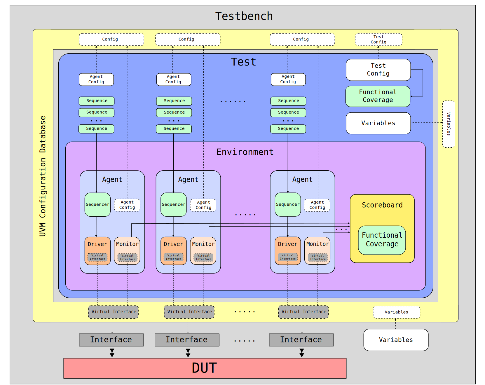
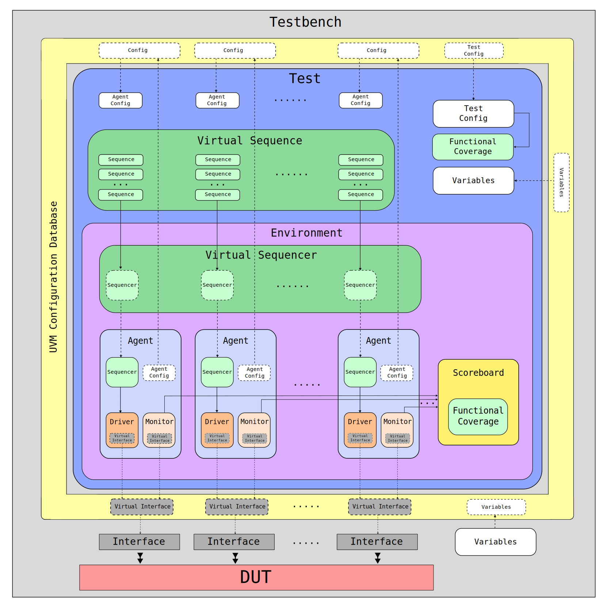

# Лабораторная работа 6 "Иерархия типового UVM окружения"

- [Лабораторная работа 6 "Иерархия типового UVM окружения"](#лабораторная-работа-6-иерархия-типового-uvm-окружения)
  - [Цель](#цель)
  - [Ход работы](#ход-работы)
  - [Основные обозначения](#основные-обозначения)
  - [Вступление](#вступление)
  - [Теория основная](#теория-основная)
    - [1. Иерархия типового UVM окружения](#1-иерархия-типового-uvm-окружения)
      - [1.1 Модуль верхнего уровня (`Testbench`)](#11-модуль-верхнего-уровня-testbench)
      - [1.2 Класс тестового сценария (`Test`)](#12-класс-тестового-сценария-test)
      - [1.3 Класс окружения (`Environment`)](#13-класс-окружения-environment)
      - [1.4 Класс агента (`Agent`)](#14-класс-агента-agent)
      - [1.5 Класс `Scoreboard`](#15-класс-scoreboard)
    - [2. Виртуальный секвенсер](#2-виртуальный-секвенсер)
  - [Теория дополнительная](#теория-дополнительная)
    - [1. UVM run\_test()](#1-uvm-run_test)
    - [2. UVM objections](#2-uvm-objections)
    - [3. `uvm_analysis_imp_decl`](#3-uvm_analysis_imp_decl)
    - [4. UVM sequence m\_sequencer](#4-uvm-sequence-m_sequencer)
  - [Лабораторная работа](#лабораторная-работа)
  - [Список ссылок](#список-ссылок)


## Цель

Разбор иерархии типового UVM-окружения. Использование UVM классов теста (`uvm_test`), окружения (`uvm_env`). Проверка корректности работы дизайна при помощи UVM класса `uvm_scoreboard`. Использование виртуального секвенсера (UVM virtual sequencer), его связь с виртуальной последовательностью (UVM virtual sequence). Настройка тестовых сценариев. Пример построения полноценного UVM окружения.

## Ход работы

1. Изучение теории;
2. Выполнение [задания](#лабораторная-работа).

## Основные обозначения

|Так выделяется важная информация, на которой стоит заострить внимание|
|:---|

_Так выделяется разбор примеров._

`Так выделяются определения, и ключевые слова SystemVerilog.`


## Вступление


## Теория основная

### 1. Иерархия типового UVM окружения

На рисунке ниже представлена иерархия типового UVM окружения.



#### 1.1 Модуль верхнего уровня (`Testbench`)

Модуль верхнего уровня является по своей сути контейнером, в котором находится тестируемое устройство и интерфейсы подключаемые к нему.

Также в некоторых случаях в модуле верхнего уровня находятся глобальные настройки (на схеме обозначены, как `Variables`).

В большинстве случаев в модуле верхнего уровня присутствует один `initial` блок, в котором в базу данных отправляются указатели на интерфейсы и  (опционально) глобальные настройки, после чего запускается тест при помощи `run_test()`, где в качестве опционального аргумента передается имя тестового сценария.

_Типовое описание модуля верхнего уровня:_

```systemverilog
module testbench;
  
  `include "uvm_macros.svh"
  import uvm_pkg::*;

  // Инстанциирование интерфейсов
  apb_intf  apb_if;
  axis_intf axis_if;

  // Инстанциирование модуля для проверки
  my_design #(
    // <параметры>
  ) DUT (
    // <сигналы>
  );

  initial begin
    // Передача интерфейсов
    uvm_resource_db#(virtual apb_intf)::set("*_ag.*", "apb_if", apb_if);
    uvm_resource_db#(virtual axis_if)::set("*_ag.*", "axis_if", axis_if);
    // Передача глобальных настроек
    uvm_resource_db#(string)::set("*", "global_message", "Hello world!");
    // Запуск теста
    run_test();
  end

endmodule
```

Подробное объяснение механики `run_test()` приведено в разделе дополнительной теории [UVM run_test()](#1-uvm-run_test).


#### 1.2 Класс тестового сценария (`Test`)

|Класс тестового сценария отвечает за глобальную настройку иерархии и поведения окружения.|
|:---|

Часто данный класс содержит общий класс конфигурации (`Test Config`), который может быть сгенерирован случайным образом с учетом некоторых ограничений. Общая конфигурация содержит переменные, которые используются множеством компонентов. В качестве примера можно привести настройку тестируемого устройства при помощи записи значений в его регистры. Тогда информация о значениях в этих регистрах должна быть известна как минимум в `sequence` и `Scoreboard` (описание класса `Scoreboard` представлено в разделе []()) для генерации входных воздействий и для правильного функционирования эталонной модели устройства.

_Предположим, что устройство содержит четыре 32-битных R/W регистра, определяющих его работу. Тогда общий класс конфигурации может выглядеть следующим образом:_

```systemverilog
class my_design_config extends uvm_object;

  `uvm_object_utils(my_design_config)

  function new(string name = "");
    super.new(name);
  endfunction

  rand bit [31:0] data;
  rand bit [31:0] samples;
  rand bit [31:0] id;
  rand bit [31:0] start;

  constraint data_c {
    data < 1024;
  }

  constraint samples_c {
    samples inside {2, 4, 8};
  }

  constraint id_c {
    if ( samples == 2 ) {
      id == 0;
    } else {
      id inside {[1:10]};
    }
  }

  constraint start_c {
    start inside {0, 1};
  }

endclass
```

В большинстве случаев класс общей конфигурации отправляется в базу данных для всех компонентов и объектов окружения.

_Пример._

```systemverilog
uvm_resource_db#(my_design_config)::set("*", "cfg", cfg);
```

Ко всему прочему, при наличии класса общей конфигурации, часто создается функциональное покрытие (`Functional Coverage`) для контроля сценариев, на которых было протестировано устройство. 

_Пример._

```systemverilog
covergroup my_design_config_cg with function sample(my_design_config cfg);
  coverpoint cfg.samples;
  coverpoint cfg.id;
  coverpoint cfg.start;
endgroup

// ...

my_design_config_cg cg;

// ...

cg.sample(cfg);
```

Также класс тестового сценария содержит классы конфигурации агентов, каждая из которых отправляется в базу данных для своего собственного.

_Пример._

```systemverilog
uvm_resource_db#(agent_config)::set("env.apb_ag", "cfg", apb_cfg);
uvm_resource_db#(agent_config)::set("env.axis_ag", "cfg", axis_cfg);
```

Как видно из кода выше, часто класс конфигурации для агентов различных интерфейсов может быть общим (одного типа). Хорошим примером здесь является настройка `is_active`, которая определяет наличие в агенте драйвера и секвенсера.

_Пример простейшего класса конфигурации агента:_

```systemverilog
class agent_config extends uvm_object;

  `uvm_object_utils(agent_config)

  uvm_active_passive_enum is_active;

  function new(string name = "");
    super.new(name);
  endfunction

endclass
```

Помимо всего прочего в классе тестового сценария располагаются последовательности, которые будут (или могут быть) использованы для генерации входных воздействий на тестируемое устройство. Каждая последовательность запускается на секвенсере определенного агента. Например, APB последовательность на секвеснере APB агента, а AXI Stream последовательность на секвеснере AXI Stream агента.

Запуск последовательностей принято оборачивать в `phase.raise_objection()`-`phase.drop_objection()`. Подробнее про этот механизм написано в разделе дополнительной теории [UVM Objections](#2-uvm-objections).

_Пример._

```systemverilog
phase.raise_objection(this);
// APB
apb_seq = apb_sequence::type_id::create("apb_seq");
apb_seq.start(env.apb_ag.seqr);
// AXI Stream
axis_seq = axis_sequence::type_id::create("axis_seq");
axis_seq.start(env.axis_ag.seqr);
phase.drop_objection(this);
```

Последним компонентом, содержащимся в классе тестового сценария, явлется класс окружения (`Environment`), который будет разобран в [разделе ниже](#13-класс-окружения-environment).

Как правило, конфигурации и функциональное покрытие создаются и в ходе `build_phase()`, генерация данных через последовательности в ходе `main_phase()`.

_Обобщая вышесказанное приведем пример класса тестового сценария:_

```systemverilog
class my_design_test extends uvm_test;

  `uvm_component_utils(my_design_test)

  // Конфигурации
  my_design_config cfg;
  agent_config apb_cfg;
  agent_config axis_cfg;

  // Покрытие конфигураций
  my_design_config_cg cfg_cg;

  // Окружение
  my_design_env env;

  // Последовательности
  apb_sequence apb_seq;
  axis_sequence axis_seq;

  function new(string name = "", uvm_component parent = null);
    super.new(name);
  endfunction

  virtual function void build_phase(uvm_phase phase);

    // Создание покрытия конфигурации
    cfg_cg = new();

    // Создание, рандомизация и покрытие общей конфигурации
    cfg = my_design_config::type_id::create("cfg");
    cfg.randomize();
    uvm_resource_db#(my_design_config)::set("*", "cfg", cfg);
    cfg_cg.sample(cfg);

    // Создание конфигураций агентов
    apb_cfg = agent_config::type_id::create("apb_cfg");
    apb_cfg.is_active = UVM_ACTIVE;
    uvm_resource_db#(agent_config)::set("env.apb_ag", "cfg", apb_cfg);
    axis_cfg = agent_config::type_id::create("axis_cfg");
    axis_cfg.is_active = UVM_ACTIVE;
    uvm_resource_db#(agent_config)::set("env.axis_ag", "cfg", axis_cfg);

    // Создание окружения
    env = my_design_env::type_id::create("env", this);

  endfunction

  virtual task main_phase(uvm_phase phase);

    // Создание и запуск последовательностей
    phase.raise_objection(this);
    // APB
    apb_seq = apb_sequence::type_id::create("apb_seq");
    apb_seq.start(env.apb_ag.seqr);
    // AXI Stream
    axis_seq = axis_sequence::type_id::create("axis_seq");
    axis_seq.start(env.axis_ag.seqr);
    phase.drop_objection(this);

  endtask

endclass
```

#### 1.3 Класс окружения (`Environment`)

Класс окружения, как правило, содержит в себе агенты для каждого интерфейса и класс `Scoreboard` для проверки корректности работы дизайна и сбора функционального покрытия.

Основная функция класса окружения - создание и соединение компонентов. Компоненты создаются и в ходе `build_phase()`, соединения между ними в ходе `connect_phase()`. Примером классического соединения для класса окружения является соединение мониторов со scoreboard.

_Пример._

```systemverilog
class my_design_env extends uvm_env;

  `uvm_component_utils(my_design_env)
  
  // Агенты
  apb_agent  apb_ag;
  axis_agent axis_ag;

  // Scoreboard
  my_design_scb scb;

  function new(string name = "", uvm_component parent = null);
    super.new(name);
  endfunction

  // Создание компонентов
  virtual function void build_phase(uvm_phase phase);
    apb_ag = apb_agent::type_id::create("apb_ag");
    axis_ag = axis_agent::type_id::create("axis_ag");
    scb = my_design_scb::type_id::create("scb");
  endfunction

  // Соединение компонентов
  virtual function void connect_phase(uvm_phase phase);
    apb_ag.monitor.ap.connect(scb.apb_imp);
    axis_ag.monitor.ap.connect(scb.axis_imp);
  endfunction

endclass
```

#### 1.4 Класс агента (`Agent`)

Класс агента был подробно разобран в ходе [4 лабораторной работы](https://github.com/MPSU/UVM4DV/tree/master/lab04_uvm_agent#%D1%80%D0%B5%D0%B0%D0%BB%D0%B8%D0%B7%D0%B0%D1%86%D0%B8%D1%8F-%D0%BA%D0%BE%D0%BD%D1%84%D0%B8%D0%B3%D1%83%D1%80%D0%B8%D1%80%D1%83%D0%B5%D0%BC%D0%BE%D0%B3%D0%BE-%D0%B0%D0%B3%D0%B5%D0%BD%D1%82%D0%B0).


#### 1.5 Класс `Scoreboard`

Класс `Scoreboard` служит для проверки корректности работы тестируемого дизайна и сбора функционального покрытия.

В большинстве случаев scoreboard собирает транзакции со всех мониторов окружения и использует их для совершения проверок и сбора покрытия.

_Пример покрытия для AXI Stream._

```systemverilog
covergroup axis_seq_item_cg with function sample(axis_seq_item t);
  data_intervals_cp: coverpoint t.data {
    bins intervals [] = {[0:$]};
  }
  data_special_cp: coverpoint t.data {
    bins special = {555, 777};
  }
  id_special_cp: coverpoint t.data {
    bins special = {0, 1};
  }
  dataXid: cross data_special_cp, id_special_cp;
endgroup
```

Класс `Scoreboard` реализует имплементации `uvm_analysis_imp` для транзакций различных типов. В большинстве случаев это делается посредством макроса `uvm_analysis_imp_decl`. Подробнее про этот макрос написано в разделе дополнительной теории [uvm_analysis_imp_decl](#2-uvm-objections).

`Scoreboard` может обращаться к базе данных для получения специфичных для конкретного теста параметров. Например, общей конфигурации.

_Пример._

```systemverilog

uvm_analysis_imp_decl(_apb)
uvm_analysis_imp_decl(_axis)

class my_design_scoreboard extends uvm_scoreboard;

  `uvm_component_utils(my_design_scoreboard)

  // Указатель на общую конфигурацию
  my_design_config cfg;

  // Очередь AXI Stream транзакций
  axis_seq_item axis_packet [$];

  // Имплементации
  uvm_analysis_imp_apb #(apb_seq_item, my_design_scoreboard) apb_imp;
  uvm_analysis_imp_axis #(axis_seq_item, my_design_scoreboard) axis_imp;

  function new(string name = "", uvm_component parent = null);
    super.new(name);
  endfunction

  virtual function void build_phase(uvm_phase phase);
      // Получение общей конфигурации из базы данных
      uvm_resource_db#(my_design_config)::read_by_name(get_full_name(), "cfg", cfg, this);
      // Создание имплементаций
      apb_imp = new("apb_imp", this);
      axis_imp = new("axis_imp", this);
  endfunction

  // Реализация имплементаций
  virtual task write_apb(apb_seq_item t);
    apb_seq_item t_;
    $cast(t_, t.clone());
    // <проверки>
  endtask

  virtual task write_axis(axis_seq_item t);
    axis_seq_item t_;
    $cast(t_, t.clone());
    // Запись в очередь
    axis_packet.push_back(t_);
    // Если последняя транзакция - проверяем
    if( t_.last ) do_check();
    // <проверки>
  endtask

  virtual function void check();
    if( axis_packet.size() != cfg.samples )
      `uvm_fatal(get_name(), $sformatf(
        "Size of AXI Stream packet is not %0d", cfg.samples));
    // <проверки>
  endfunction

endclass
```

### 2. Виртуальный секвенсер

В лабораторной работе 4 в упрощенном формате была разобрана виртуальная последовательность. [Ссылка на раздел](https://github.com/MPSU/UVM4DV/tree/master/lab05_stimulus_routing#%D0%B2%D0%B8%D1%80%D1%82%D1%83%D0%B0%D0%BB%D1%8C%D0%BD%D0%B0%D1%8F-%D0%BF%D0%BE%D1%81%D0%BB%D0%B5%D0%B4%D0%BE%D0%B2%D0%B0%D1%82%D0%B5%D0%BB%D1%8C%D0%BD%D0%BE%D1%81%D1%82%D1%8C).

Заметим, что для запуска виртуальной последовательности необходимо иметь доступ к каждому из секвенсеров, на которых будут запускаться внутренние последовательности.

Самым популярным подходом для получаея доступа к секвенсерам всех агентов является виртуальный секвенсер.

Рассмотрим обновленную иерархию верификационного окружения.



В новой иерархию появились две новые составляющие - виртуальная последовательность (`Virtual Sequence`) и виртуальный секвенcер (`Virtual Sequencer`).

Виртуальная последовательность инкапсулирует в себе все последовательности, которые будут запущены на всех секвенсерах окружения.

_Пример виртуальной последовательности._

```systemverilog
class my_design_vseq extends uvm_sequence; // -
  //                                           |
  // uvm_sequencer m_sequencer <---------------

  // ...

  // Последовательности
  apb_sequence apb_seq;
  axis_sequence axis_seq;

  // Тело
  virtual task body();
    // Запуск последовательностей
    apb_seq = apb_sequence::type_id::create("apb_seq");
    apb_seq.start(m_sequencer.apb_seqr);
    axis_seq = axis_sequence::type_id::create("axis_seq");
    axis_seq.start(m_sequencer.axis_seqr);
  endtask

endclass
```

Известно, что при запуске последовательности выполнится задача `body()`. Таким образом, в этой задаче можно создать и запустить все внутренние последотельности.

В классе `uvm_sequence` существует поле `m_sequencer`, которое при запуске последовательности инициализируется указателем на секвеснер, на котором исполняется текущая последовательность. Таким образом при выполнении задачи `body()` поле `m_sequencer` указывает на секвенсер, на котором исполняется виртуальная последовательность.

На что же указывает `m_sequencer`. Верно. На виртуальный секвенсер.

_Пример виртуального секвенсера._

```systemverilog
class my_design_vseqr extends uvm_sequencer;

  // ...

  // Указатели на секвесеры
  apb_seqr  apb_seqr;
  axis_seqr axis_seqr;

endclass
```

Виртуальный секвенсер содержит указатели на секвенсеры агентов окружения. Таким образом, в `body()` виртуальной последовательности мы можем обращаться к конкретному секвенсеру через `m_sequencer.<name>`.

Указатели виртуального секвенсера инициализируются в `connect_phase()` класса окружения `Environment`.

```systemverilog
virtual function void connect_phase(uvm_phase phase);
// ...
vseqr.apb_seqr  = apb_ag.apb_seqr;
vseqr.axis_seqr = axis_ag.axis_seqr;
endfunction
```
Виртуальная последовательность запускается в `main_phase()` класса тестового сценария `Test`.

```systemverilog
  virtual task main_phase(uvm_phase phase);

    // Создание и запуск последовательностей
    phase.raise_objection(this);
    vseq = my_design_vseq::type_id::create("vseq");
    vseq.start(env.vseqr);
    phase.drop_objection(this);

  endtask
```

_Пример классов тестового сценария и окружения с виртуальной последовательностью и виртуальным секвенсером._

```systemverilog
class my_design_test extends uvm_test;

  `uvm_component_utils(my_design_test)

  // Конфигурации
  my_design_config cfg;
  agent_config apb_cfg;
  agent_config axis_cfg;

  // Покрытие конфигураций
  my_design_config_cg cfg_cg;

  // Окружение
  my_design_env env;

  // Виртуальная последовательность
  my_design_vseq vseq;

  function new(string name = "", uvm_component parent = null);
    super.new(name);
  endfunction

  virtual function void build_phase(uvm_phase phase);

    // Создание покрытия конфигурации
    cfg_cg = new();

    // Создание, рандомизация и покрытие общей конфигурации
    cfg = my_design_config::type_id::create("cfg");
    cfg.randomize();
    uvm_resource_db#(my_design_config)::set("*", "cfg", cfg);
    cfg_cg.sample(cfg);

    // Создание конфигураций агентов
    apb_cfg = agent_config::type_id::create("apb_cfg");
    apb_cfg.is_active = UVM_ACTIVE;
    uvm_resource_db#(agent_config)::set("env.apb_ag", "cfg", apb_cfg);
    axis_cfg = agent_config::type_id::create("axis_cfg");
    axis_cfg.is_active = UVM_ACTIVE;
    uvm_resource_db#(agent_config)::set("env.axis_ag", "cfg", axis_cfg);

  endfunction

  virtual task main_phase(uvm_phase phase);

    // Создание и запуск последовательностей
    phase.raise_objection(this);
    vseq = my_design_vseq::type_id::create("vseq");
    vseq.start(env.vseqr);
    phase.drop_objection(this);

  endtask

endclass
```

```systemverilog
class my_design_env extends uvm_env;

  `uvm_component_utils(my_design_env)
  
  // Агенты
  apb_agent  apb_ag;
  axis_agent axis_ag;

  // Виртуальный секвенсер
  my_design_vseqr vseqr;

  // Scoreboard
  my_design_scb scb;

  function new(string name = "", uvm_component parent = null);
    super.new(name);
  endfunction

  // Создание компонентов
  virtual function void build_phase(uvm_phase phase);
    apb_ag = apb_agent::type_id::create("apb_ag");
    axis_ag = axis_agent::type_id::create("axis_ag");
    vseqr = my_design_vseqr::type_id::create("vseqr");
    scb = my_design_scb::type_id::create("scb");
  endfunction

  // Соединение компонентов
  virtual function void connect_phase(uvm_phase phase);
    // Монитор - scoreboard
    apb_ag.monitor.connect(scb.apb_imp);
    axis_ag.monitor.connect(scb.axis_imp);
    // Виртуальный секвенсер
    vseqr.apb_seqr  = apb_ag.apb_seqr;
    vseqr.axis_seqr = axis_ag.axis_seqr;
  endfunction

endclass
```

## Теория дополнительная

### 1. UVM run_test()

### 2. UVM objections

UVM Objections были разобраны в ходе 3 лабораторной работы. [Ссылка на раздел](https://github.com/MPSU/UVM4DV/blob/master/lab03_uvm_phases/README.md#%D0%B2%D0%BE%D0%B7%D1%80%D0%B0%D0%B6%D0%B5%D0%BD%D0%B8%D1%8F-objections).

### 3. `uvm_analysis_imp_decl`

`uvm_analysis_imp_decl` позволяет в рамках одного класса `Scoreboard` реализовывать несколько имплементаций одного типа. В случае `Scoreboard` типа `analysis`. Подробно семейство макросов `uvm_*_imp_decl` было разобрано в ходе 2 лабораторной работы. [Ссылка на раздел](https://github.com/MPSU/UVM4DV/tree/master/lab02_tlm_and_sync#85-%D0%BC%D0%BD%D0%BE%D0%B6%D0%B5%D1%81%D1%82%D0%B2%D0%B5%D0%BD%D0%BD%D0%B0%D1%8F-%D1%80%D0%B5%D0%B0%D0%BB%D0%B8%D0%B7%D0%B0%D1%86%D0%B8%D1%8F-tlm-api-%D0%B2-%D1%80%D0%B0%D0%BC%D0%BA%D0%B0%D1%85-%D0%BE%D0%B4%D0%BD%D0%BE%D0%B3%D0%BE-uvm-%D0%BE%D0%B1%D1%8A%D0%B5%D0%BA%D1%82%D0%B0-uvm__imp_decl).

### 4. UVM sequence m_sequencer

## Лабораторная работа


## Список ссылок

---